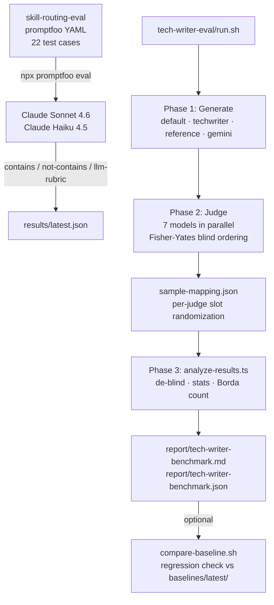

# Testing infrastructure

magus-bench measures documentation and skill-routing quality for the Magus Claude Code plugin ecosystem. It uses LLM-as-judge evaluation — models score other models' outputs against structured rubrics.

The infrastructure spans two repositories (`magus-bench` and the sibling `claude-code` repo) and three testing layers:

| Layer | Location | Engine | Purpose |
|-------|----------|--------|---------|
| promptfoo unit | `magus-bench/skill-routing-eval/` | promptfoo + YAML | Fast, declarative skill routing assertions |
| autotest integration | `claude-code/autotest/` | `runner-base.sh` + real Claude CLI | End-to-end plugin/skill behavior |
| tech-writer acceptance | `magus-bench/tech-writer-eval/` | 4-way blind benchmark | Deep documentation quality measurement |

## Quick start

```bash
# Skill routing eval (fastest — no API execution cost for deterministic checks)
cd skill-routing-eval
export ANTHROPIC_API_KEY="sk-ant-..."
npx promptfoo eval -c promptfooconfig.yaml
npx promptfoo view

# Full tech-writer benchmark (requires claude, claudish, bun, jq)
cd tech-writer-eval
./run.sh --dry-run          # preview without API calls
./run.sh                    # full generate → judge → analyze
```

## Architecture



### How the layers relate

**promptfoo** (skill-routing-eval) tests prompt-level routing behavior without running the full Claude Code CLI. Each test case sends a prompt to a model via the Anthropic API and checks the response with deterministic string assertions plus LLM-rubric soft scoring. Fast iteration — a full run takes under two minutes.

**autotest** (in `../claude-code`) runs the real `claude -p` CLI with plugins, CLAUDE.md, hooks, and MCP loaded. The framework spawns actual Claude Code sessions and inspects JSONL transcripts for correct agent delegation. This is where real plugin-ecosystem behavior is validated.

**tech-writer-eval** measures documentation quality at the output level. It generates docs four ways, routes them to 7 judge models with per-judge randomized orderings, and computes Borda count rankings with statistical significance tests. A full run takes 20–40 minutes and costs roughly $5–15 in API calls.

---

## tech-writer-eval

The 4-way blind documentation benchmark. It answers: does adding the anti-slop documentation skill to Claude improve output quality, and by how much compared to a human-written reference and to Gemini?

### Pipeline

`run.sh` runs three sequential phases:

```bash
./tech-writer-eval/run.sh [OPTIONS]

Options:
  --output-dir <dir>     Save results here (default: results/run-TIMESTAMP)
  --timeout <seconds>    Per-execution timeout (default: 600)
  --skip-generate        Reuse existing generated docs (requires --output-dir)
  --skip-judge           Reuse existing judge outputs (requires --output-dir)
  --compare-baseline     Run regression check after Phase 3
  --dry-run              Show what would run without executing
```

**Phase 1 — Generate.** Four approaches produce documentation on the same topic:

| Approach | Method | Prompt |
|----------|--------|--------|
| `default` | `claude -p` (native) | Vanilla prompt, no style guidance |
| `techwriter` | `claude -p` (native) | Anti-slop documentation skill prompt |
| `reference` | File copy | Human-written `reference/reference.md` |
| `gemini` | `claudish --model google/gemini-3-flash-preview` | Same anti-slop prompt as techwriter |

The Gemini output passes through `strip_coaching_prefix()` to remove any dev plugin coaching blocks injected by the SessionStart hook.

**Phase 2 — Judge.** Seven external models score all four samples independently:

```
internal  minimax  kimi  glm  gemini  gpt  qwen
```

Each judge receives a unique Fisher-Yates shuffle of the four sample slots (A/B/C/D). The mapping is recorded in `sample-mapping.json`. The judge template injects `{{SAMPLE_A}}` through `{{SAMPLE_D}}` placeholders with the shuffled content. This prevents position bias — no judge sees the same ordering as any other.

Judges run in parallel. The minimum passing threshold is 3 successful judges (configurable in `test-cases.json`).

**Phase 3 — Analyze.** `analyze-results.ts` de-blinds the slot labels back to approach names, computes per-criterion statistics, and produces two output files:

```
results/run-TIMESTAMP/
├── report/tech-writer-benchmark.json   # Full structured report
├── report/tech-writer-benchmark.md     # Human-readable tables
├── sample-mapping.json                 # Slot randomization record
├── generate/
│   ├── default/output.md
│   ├── techwriter/output.md
│   ├── reference/output.md
│   └── gemini/output.md
└── judge/
    ├── internal/response.txt
    ├── minimax/response.txt
    └── ...
```

### Scoring criteria

Nine criteria with weights totaling 14.0:

| Criterion | ID | Weight | Description |
|-----------|----|--------|-------------|
| AI Slop Absence | `slop` | 2.0 | Word-level, structural, and pattern slop (banned words, formulaic paragraphs, throat-clearing) |
| Writing Craft | `writing_craft` | 2.0 | Sentence variety, active voice, precise verbs |
| Readability | `readability` | 1.5 | Sentence length, passive voice rate, scannability |
| Document Structure | `structure` | 1.5 | Heading hierarchy, metadata header, section ordering |
| Conciseness | `conciseness` | 1.0 | Information density, no filler |
| Internal Consistency | `accuracy` | 2.0 | No contradictions, no hallucinated APIs |
| Progressive Disclosure | `disclosure` | 1.0 | Essential info first, layered examples |
| Diagram Quality | `diagrams` | 1.0 | Useful diagrams, not decorative |
| Overall Quality | `overall` | 2.0 | Would you publish this as-is? |

Scores range 1–10. The weighted overall score divides the criterion-weight sum by 14.0.

### Judge response format

Judges write a `<thinking>` chain-of-thought block before the JSON scores. The analyzer strips this block before parsing:

```json
{
  "scores": {
    "sample_a": { "slop": 7, "writing_craft": 8, "readability": 7, "structure": 8,
                  "conciseness": 7, "accuracy": 9, "disclosure": 7, "diagrams": 3, "overall": 7 },
    "sample_b": { ... },
    "sample_c": { ... },
    "sample_d": { ... }
  },
  "ranking": ["C", "A", "D", "B"],
  "reasoning": "Sample C demonstrated..."
}
```

The analyzer tries three parse strategies in order: direct JSON parse, markdown-fenced JSON, regex scan for `"scores"` + `"sample_a"`. Missing scores default to 5.

### Statistical analysis

The analyzer computes:

- **Borda count**: 3 pts for 1st, 2 for 2nd, 1 for 3rd, 0 for 4th, summed across all judges. Ties broken by weighted score.
- **Friedman omnibus test**: non-parametric repeated measures (chi-squared with df = k−1). With 7 judges and 4 approaches, deltas under ~0.8 points fall within measurement noise.
- **Wilcoxon pairwise**: signed-rank test for each approach pair, Bonferroni corrected for the 6 comparison pairs.
- **Bootstrap 95% CI**: 1000 resamples of per-judge weighted scores.

### Baseline regression system

Capture a baseline after a good run, then compare future runs against it:

```bash
# Snapshot the current run as the regression baseline
./tech-writer-eval/capture-baseline.sh results/run-20260317-120000

# Compare a new run against the stored baseline (exits 1 if any regression)
./tech-writer-eval/compare-baseline.sh results/run-20260318-090000

# Run the full benchmark and auto-compare on completion
./tech-writer-eval/run.sh --compare-baseline
```

The regression threshold is −0.5 points per (approach, criterion) pair. `capture-baseline.sh` writes `baselines/<run-name>/scores.json` and `baselines/latest/scores.json`. `compare-baseline.sh` reads `baselines/latest/scores.json` and exits 1 if any metric dropped beyond the threshold.

**scores.json schema:**

```json
{
  "weighted_scores": { "default": 7.3, "techwriter": 7.9, "reference": 8.4, "gemini": 6.8 },
  "borda_counts":    { "reference": 16, "techwriter": 14, "default": 8, "gemini": 4 },
  "absolute_ranking": ["reference", "techwriter", "default", "gemini"],
  "criteria": [
    {
      "criterion_id": "slop",
      "criterion_name": "AI Slop Absence",
      "weight": 2,
      "mean_by_approach": { "default": 6.1, "techwriter": 7.4, "reference": 9.1, "gemini": 6.8 }
    }
  ]
}
```

### execute-test.sh

`execute-test.sh` is a standalone single-test executor bundled into `tech-writer-eval/` for reproducibility. It supports two backends:

**Native Claude mode** (`--model internal`):
```bash
claude -p --verbose --output-format stream-json --dangerously-skip-permissions \
  --plugin-dir ../plugins/dev < prompt.md > transcript.jsonl
```

**Claudish mode** (any other model string):
```bash
claudish -y --json --debug --log-level debug --model google/gemini-2.5-flash \
  --stdin < prompt.md > transcript.jsonl
```

Output files per execution:

| File | Contents |
|------|----------|
| `transcript.jsonl` | JSONL conversation with tool calls and final result |
| `debug.log` | Timing, token counts, tool usage metrics |
| `meta.json` | Test ID, model, timestamps, duration, exit code |
| `.exit` | Exit code file for background polling |

---

## skill-routing-eval

Promptfoo benchmark for skill routing behavior. Tests whether Claude correctly distinguishes the Skill tool from the Task tool, honors CLAUDE.md routing tables, and avoids typos in tool names.

### Test cases

22 test cases across 11 categories:

| Category | Count | What it checks |
|----------|-------|----------------|
| `explicit-skill` | 3 | Named skill must use Skill tool, never Task |
| `implicit-skill` | 1 | Routing table inference triggers correct skill |
| `agent-vs-skill` | 1 | Skill name must not appear as Task `subagent_type` |
| `spelling` | 1 | Bash commands after skill load spell `claudemem` correctly |
| `mixed-routing` | 1 | Skill for one part, Task agent for another |
| `no-skill` | 1 | Simple task handled directly, no tool invocation |
| `explicit-delegation` | 5 | Named agent honored via Task call |
| `passive-routing` | 2 | Complex task triggers correct specialist via CLAUDE.md |
| `implicit-delegation` | 1 | Deep investigation implies `code-analysis:detective` |
| `hinted-delegation` | 4 | "Use a subagent" hint respected |
| `direct-handling` | 2 | Simple lookup handled inline, no Task call |

The three failure modes that motivated this benchmark (identified 2026-02-16):

| Failure | Detection method |
|---------|-----------------|
| Skill-as-agent: `claudemem-search` launched as Task `subagent_type` | `llm-rubric` |
| Routing table miss: complex task handled inline instead of delegating | `llm-rubric` |
| Spelling typo: Bash command spells `claudemem` as `clademem` | `not-contains: clademem` |

### Assertion types

Each test uses up to three assertion types:

```yaml
assert:
  # Hard binary check — substring must be present
  - type: contains
    value: "claudemem"
    metric: "mentions-claudemem"

  # Hard binary check — substring must be absent
  - type: not-contains
    value: "clademem"
    metric: "no-typo-clademem"

  # Soft LLM-scored check — judge evaluates against rubric
  - type: llm-rubric
    value: >
      The response must invoke the Skill tool (not Task) to load
      "code-analysis:claudemem-search". A Task call whose subagent_type
      is "code-analysis:claudemem-search" is a FAILURE.
    provider: anthropic:messages:claude-sonnet-4-6
    metric: "correct-skill-tool-usage"
```

### Running

```bash
cd skill-routing-eval
export ANTHROPIC_API_KEY="sk-ant-..."

# Run all 22 cases against both providers (Sonnet 4.6 + Haiku 4.5)
npx promptfoo eval -c promptfooconfig.yaml

# Narrow to one provider
npx promptfoo eval -c promptfooconfig.yaml --providers "Claude Sonnet 4.6"

# Filter to one category
npx promptfoo eval -c promptfooconfig.yaml --filter-metadata category=explicit-skill

# Filter to one case by ID
npx promptfoo eval -c promptfooconfig.yaml --filter-metadata id=skill-claudemem-explicit-01

# Open web UI
npx promptfoo view
```

Results write to `results/latest.json`. The `correct-skill-tool-usage` metric is the primary signal — if it fails, check whether CLAUDE.md still contains the skill routing table.

Expected pass rates on a healthy system:

- All `contains` / `not-contains`: 100% (deterministic)
- `llm-rubric` on `explicit-*` groups: > 80%
- `llm-rubric` on `passive-routing` and `implicit-delegation`: > 60%

### Synthetic test generation

The 22 seed cases can be expanded to 100+ variants for better statistical coverage:

```bash
cd skill-routing-eval

# Preview generation plan (no API calls)
./generate-tests.sh --dry-run

# Generate with defaults (10 variations per seed → ~220 raw, ~100-210 after dedup)
./generate-tests.sh

# Generate more variations
./generate-tests.sh --count 15

# Custom output directory
./generate-tests.sh --out-dir /tmp/routing-tests
```

The generator produces 6 variant types per seed: `rephrased`, `edge_case`, `adversarial`, `context_shift`, `terse`, `verbose`. Near-duplicates are dropped using Jaccard similarity (threshold: 0.80 on tokens longer than 3 characters). Output lands in `generated/test-cases-generated.yaml` (promptfoo format) and `generated/test-cases-generated.json` (autotest format).

---

## CI pipeline

Two GitHub Actions workflows run on push and PR to `main`.

### ci.yml

Three jobs, no API keys required:

**lint** — TypeScript type check + shellcheck:
```bash
bun build --no-bundle tech-writer-eval/analyze-results.ts --outdir /tmp/ts-check
shellcheck tech-writer-eval/run.sh
shellcheck tech-writer-eval/execute-test.sh
```

**dry-run** — validates config and pipeline wiring. Installs a `claudish` stub (no-op shell script) so the dependency check passes without real credentials, then runs:
```bash
./tech-writer-eval/run.sh --dry-run
# 8 separate jq -e checks on test-cases.json:
jq -e 'type == "object"' tech-writer-eval/test-cases.json
jq -e '.topic | type == "object"' tech-writer-eval/test-cases.json
jq -e '.approaches | type == "array" and length > 0' tech-writer-eval/test-cases.json
jq -e '.evaluation.criteria | type == "array" and length > 0' tech-writer-eval/test-cases.json
jq -e '.judges | type == "array" and length > 0' tech-writer-eval/test-cases.json
jq -e '.thresholds | type == "object"' tech-writer-eval/test-cases.json
jq -e '.evaluation.criteria | all(has("id","name","weight","description"))' tech-writer-eval/test-cases.json
jq -e '.judges | all(has("id","model","method"))' tech-writer-eval/test-cases.json
```

**analyze-existing** — runs `analyze-results.ts` against any committed result directories. Confirms the analyzer does not crash on real data. No API keys needed — reads static files only.

### shellcheck.yml

Runs on any push or PR that touches `*.sh` files. Finds all shell scripts recursively and passes them to `shellcheck`. Triggers independently from `ci.yml`.

---

## Adding new tests

### Adding a promptfoo test case

Open `skill-routing-eval/test-cases.yaml` and add a block under the appropriate category comment:

```yaml
- description: "One sentence describing what routing behavior is under test"
  metadata:
    id: skill-new-test-01          # unique kebab-case ID
    category: explicit-skill        # one of the 11 categories
    tags: [explicit, claudemem]
    source: skills/test-cases.json
  vars:
    prompt: >
      Your prompt text here. Be specific about which tool/agent is expected.
  assert:
    - type: contains
      value: "claudemem"
      metric: "mentions-claudemem"
    - type: llm-rubric
      value: >
        The response must invoke the Skill tool (not Task) to load
        "code-analysis:claudemem-search". Be explicit about what constitutes
        a PASS and what constitutes a FAILURE.
      provider: anthropic:messages:claude-sonnet-4-6
      metric: "correct-skill-tool-usage"
```

Test the new case in isolation before running the full suite:
```bash
npx promptfoo eval --filter-metadata id=skill-new-test-01
```

### Adding a tech-writer-eval topic

The benchmark evaluates one documentation topic per run, defined in `test-cases.json`. To run a different topic:

1. Update `topic.title` and `topic.context` in `test-cases.json`
2. Write `reference/reference.md` — the human-authored baseline for this topic
3. Update `prompts/generate-default.md` and `prompts/generate-techwriter.md` with topic-specific instructions
4. Run `./run.sh --dry-run` to verify the config loads
5. Run `./run.sh` for the full evaluation

To add a new judge model, append to the `judges` array in `test-cases.json`:
```json
{
  "id": "my-judge",
  "model": "provider/model-name",
  "method": "claudish"
}
```

---

## Data formats

### JSONL transcript

Each line in `transcript.jsonl` is a JSON object:

```jsonl
{"type":"session_start","id":"session-abc","timestamp":"2026-03-17T12:00:00Z"}
{"type":"assistant","message":{"content":[{"type":"text","text":"..."},{"type":"tool_use","id":"tu_1","name":"Task","input":{"subagent_type":"dev:researcher","prompt":"..."}}]}}
{"type":"tool_result","id":"tu_1","result":"..."}
{"type":"result","result":"Full final text output"}
```

The `result` entry is the preferred extraction target. The analyzer falls back to concatenating all `assistant` text blocks if no `result` entry exists.

### Judge JSON response

```json
{
  "scores": {
    "sample_a": {
      "slop": 7, "writing_craft": 8, "readability": 7, "structure": 8,
      "conciseness": 7, "accuracy": 9, "disclosure": 7, "diagrams": 3, "overall": 7
    },
    "sample_b": { ... },
    "sample_c": { ... },
    "sample_d": { ... }
  },
  "ranking": ["C", "A", "D", "B"],
  "reasoning": "Sample C demonstrated the highest slop absence..."
}
```

`ranking` lists slot labels (A/B/C/D) in order from best to worst. The analyzer maps labels back to approach names via `sample-mapping.json`.

### sample-mapping.json

```json
{
  "contestants": { "A": "default", "B": "techwriter", "C": "reference", "D": "gemini" },
  "judge_orderings": {
    "internal":  ["C", "A", "D", "B"],
    "minimax":   ["B", "D", "A", "C"],
    "kimi":      ["D", "B", "C", "A"]
  },
  "created_at": "2026-03-17T12:09:17Z"
}
```

`judge_orderings[judge_id][i]` is the contestant label placed in slot position `i` for that judge. The de-blinding step in `analyze-results.ts` inverts this mapping to recover approach-level scores.

### promptfoo results

`skill-routing-eval/results/latest.json` uses the standard promptfoo output schema. View it with `npx promptfoo view` or parse the `results` array directly for per-assertion pass/fail data.

---

## Troubleshooting

### Phase 1 generation fails with "output too short"

The minimum output length check (`min_output_chars` in `test-cases.json`, default 100) caught an empty or near-empty response.

**Causes:**
- `claudish` is not authenticated (check `OPENROUTER_API_KEY` or `ANTHROPIC_API_KEY`)
- The Gemini model name in `generation.gemini_model` has changed
- The prompt file is missing or empty

**Fix:** Run with `--dry-run` first to confirm file paths, then check credentials:
```bash
claudish --model google/gemini-3-flash-preview --stdin <<< "Say hello"
```

### Phase 2: fewer than min_judges succeed

Judges run in parallel with a 600-second timeout each. If fewer than `thresholds.min_judges` (default 3) return a response, the pipeline aborts.

**Diagnosis:**
```bash
# Check which judges produced output
ls -la results/run-TIMESTAMP/judge/*/response.txt

# Inspect a failed judge's transcript
cat results/run-TIMESTAMP/judge/minimax/transcript.jsonl
```

**Fix:** Re-run Phase 2 only (reuses existing generated docs):
```bash
./run.sh --skip-generate --output-dir results/run-TIMESTAMP
```

### Analyzer fails to parse judge JSON

The analyzer tries three strategies (direct parse, fenced code block, regex). If all fail, that judge is marked as failed and excluded from scoring.

**Diagnosis:** Check the raw response for the failed judge:
```bash
cat results/run-TIMESTAMP/judge/qwen/response.txt
```

The most common cause is a model that wraps JSON in extra prose or uses a different field name than `"scores"`.

### promptfoo `llm-rubric` assertions all fail

This typically means the model under test is not receiving the CLAUDE.md routing configuration.

**Check:** The skill-routing-eval tests assume CLAUDE.md is active in the evaluation context. The promptfoo eval sends raw prompts via the Anthropic API without a project CLAUDE.md. The `llm-rubric` assertions test whether the model's response *describes* the correct routing behavior, not whether it executes it.

If `contains` / `not-contains` assertions pass but `llm-rubric` fails, the model is mentioning the right terms but the routing logic in the response is wrong.

### Baseline comparison exits 1 unexpectedly

A regression flag means some (approach, criterion) score dropped more than 0.5 points.

```bash
# See which metrics regressed
./tech-writer-eval/compare-baseline.sh results/run-TIMESTAMP
```

Given inter-judge variance of ~0.9 sigma, deltas under 0.8 points are within measurement noise. A −0.5 trigger is intentionally sensitive. Investigate drops ≥ 0.8 points; ignore smaller fluctuations.

If you want to accept the new scores as the new baseline:
```bash
./tech-writer-eval/capture-baseline.sh results/run-TIMESTAMP
```

---

---

## Next steps

- **Add a new benchmark**: Create a directory with `run.sh`, `test-cases.json`, and a `README.md`. Add a row to the [main README](./README.md) benchmarks table.
- **Expand test coverage**: Run `./skill-routing-eval/generate-tests.sh` to generate synthetic variants from the 22 seed cases.
- **Update baselines**: After a model upgrade or prompt change, run the full tech-writer benchmark and capture the new baseline with `capture-baseline.sh`.

**Last updated**: 2026-03-17
