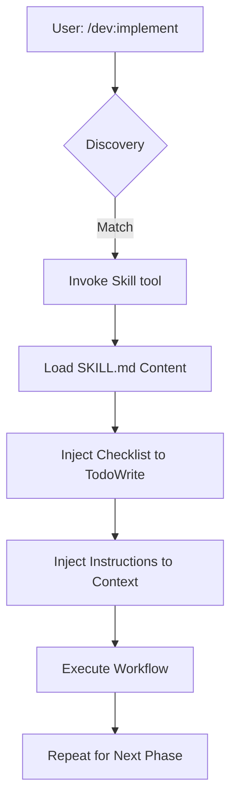

# Skill Injection in `/dev:implement`

Technical reference for discovering, loading, and chaining SKILL.md files within the dev assistant plugin.

**Audience**: Claude Code plugin developers.  
**Prerequisites**: Understanding of `plugin.json` and the `skills/` directory structure.

## Define a skill in SKILL.md

Skills are Markdown files containing YAML frontmatter that defines their triggers and behavior. Place these in your plugin's `skills/` directory.

```markdown
---
name: feature-implementation
description: Use when building new features from a specification.
triggers:
  - "implement feature"
  - "add functionality"
  - "build module"
checklist:
  - "Analyze requirements"
  - "Draft implementation plan"
  - "Execute changes"
  - "Verify with tests"
---

# Feature Implementation Workflow

Follow this process to ensure code quality and test coverage.

## 1. Analysis
Read the spec and identify affected components.

## 2. Planning
Use the `Write` tool to create `plan.md` before coding.
```

### SKILL.md Frontmatter Schema

| Field | Type | Description |
| :--- | :--- | :--- |
| `name` | string | Unique identifier used by the `Skill` tool. |
| `description` | string | Used for discovery and model routing. |
| `triggers` | string[] | Keywords that prompt Claude to suggest this skill. |
| `checklist` | string[] | Injected as `TodoWrite` tasks when the skill starts. |

## Lifecycle of a skill invocation

When a user runs `/dev:implement`, the command triggers a sequence of skill injections.



Discovery happens via semantic matching. Claude compares the user's intent against the `description` and `triggers` in all available `SKILL.md` files. Once matched, the `Skill` tool loads the file's content into the current conversation.

## Inject content into conversation context

Loading a skill does not just provide text; it alters the agent's behavior through two primary mechanisms.

1.  **Instruction Injection**: The Markdown body of the `SKILL.md` file becomes part of the system prompt for the duration of the task. This ensures Claude follows specific architectural patterns or coding standards defined in the skill.
2.  **State Initialization**: If the frontmatter contains a `checklist`, the `Skill` tool automatically calls `TodoWrite` for each item. This creates a visible progress tracker in the terminal.

```typescript
// Internal representation of skill loading
async function loadSkill(skillName: string) {
  const skill = await registry.getSkill(skillName);
  
  // 1. Update the system instructions
  agent.appendInstructions(skill.content);
  
  // 2. Initialize the task list
  for (const item of skill.checklist) {
    await tools.TodoWrite({ task: item, status: "todo" });
  }
}
```

## Chain skills in `/dev:implement`

The `/dev:implement` command is a high-level orchestrator that sequences specialized skills. It moves from abstract ideation to concrete execution by switching the active skill context.

### The implementation chain

1.  **Brainstorming**: Invokes a skill focused on exploration and trade-off analysis.
2.  **Planning**: Switches to a planning skill to generate a step-by-step technical spec.
3.  **Execution**: Loads implementation-specific skills (like TDD or frontend-patterns) to perform the actual file edits.

Because skills are modular, `/dev:implement` can swap the "Execution" skill based on the project stack. A React project might trigger a `react-component-skill`, while a Go backend triggers `golang-service-skill`.

## Create a basic skill (5-minute guide)

To create a new skill for your plugin, follow these steps.

1.  **Create the file**: Add `plugins/my-plugin/skills/refactor/SKILL.md`.
2.  **Define metadata**: Add frontmatter with clear triggers.
3.  **Write instructions**: Use imperative language to guide the model.

```markdown
---
name: simple-refactor
description: Use when cleaning up existing code without changing behavior.
triggers:
  - "refactor"
  - "clean up"
checklist:
  - "Identify code smells"
  - "Run existing tests"
  - "Apply refactoring"
  - "Verify behavior"
---

# Refactoring Protocol

Prioritize readability over brevity. If a function exceeds 20 lines, split it.
```

4.  **Register the skill**: Ensure `my-plugin` is enabled in `.claude/settings.json`.
5.  **Test the trigger**: Type "I need to refactor the user service" in the CLI.

## Handle skill edge cases

<details>
<summary>Conflicting Triggers</summary>
If two skills have similar triggers, Claude may ask which one to use or pick the one with the more specific description. Use distinct, action-oriented descriptions to prevent ambiguity.
</details>

<details>
<summary>Manual Invocation</summary>
Users can bypass discovery by explicitly calling a skill: `/skill namespace:name`. This is useful for debugging a skill's injection behavior without relying on the LLM's routing logic.
</details>

`★ Insight ─────────────────────────────────────`
- Skill injection leverages the `additionalContext` hook mechanism to modify agent behavior dynamically without permanent system prompt bloat.
- The coupling between `SKILL.md` checklists and the `TodoWrite` tool provides a deterministic way to enforce multi-step workflows in an otherwise non-deterministic LLM environment.
- Using YAML frontmatter for metadata allows the CLI to index and search skills efficiently using standard parsers before ever involving the LLM.
`─────────────────────────────────────────────────`