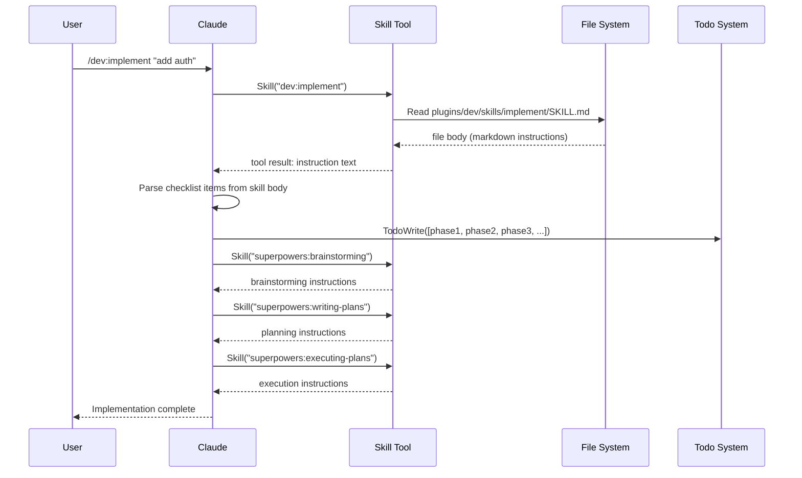
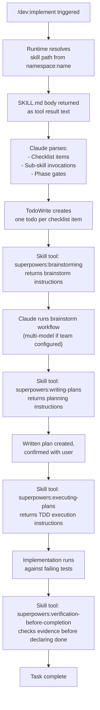

# Skill Injection in Claude Code: How `/dev:implement` Chains Skills

**Description:** How the Claude Code skill system discovers, loads, and chains SKILL.md files — with `/dev:implement` as the working example.

**Audience:** Plugin developers building new skills or commands that invoke them.

**Prerequisites:** Plugin structure (`plugin.json`, `skills/` directory), Claude Code command basics.

---

**[Skip to Quick-Start →](#create-a-basic-skill-in-5-minutes)** | **[Skip to Frontmatter Reference →](#frontmatter-schema-reference)**

---

## What Skills Actually Are

A skill is a SKILL.md file containing YAML frontmatter and a markdown body. When Claude calls the `Skill` tool with a skill name, the plugin runtime returns the entire file body as a tool result. Claude then reads that result and treats its contents as authoritative instructions — not suggestions, not context, but a behavioral contract to follow exactly.

This matters because skills are not system prompt injections. They arrive mid-conversation as tool results, which means they can override earlier instructions and trigger new tool calls, including calls to other skills.

## Skill Discovery

```
plugins/
└── dev/
    └── skills/
        ├── implement/
        │   └── SKILL.md          ← namespace "dev", name "implement"
        ├── brainstorm/
        │   └── SKILL.md          ← namespace "dev", name "brainstorm"
        └── architect/
            └── SKILL.md
```

The plugin loader derives `namespace` from the plugin's `plugin.json` `name` field and `skill-name` from the directory containing the SKILL.md file. Calling `Skill("dev:implement")` resolves to `plugins/dev/skills/implement/SKILL.md`.

Skills can also live flat in the `skills/` directory as `{skill-name}.md` — but the subdirectory-per-skill pattern is preferred because it allows co-locating supporting assets (templates, examples) alongside the SKILL.md.

The frontmatter `description` field is what Claude reads when deciding whether to invoke a skill. Write it as a trigger condition, not a feature list: `"Use when implementing any feature or bugfix, before writing implementation code."` A vague description causes missed invocations.

## The Skill Tool Invocation

When Claude calls the `Skill` tool, three things happen in sequence:

1. The runtime resolves `namespace:name` → file path
2. The SKILL.md body (everything after the frontmatter) is returned as the tool result
3. Claude reads the returned text and executes it as instructions



The critical detail: the tool result sits in the conversation as a visible message. Claude doesn't forget it when processing subsequent messages. This is why a rigid skill (one that says "follow exactly") works — the instructions remain visible in context for the entire session.

## Checklist Items and TodoWrite

When a skill body contains a checklist, Claude converts each item into a `TodoWrite` call before doing anything else. This is an explicit convention, not automatic behavior — the `using-superpowers` skill instructs Claude to do it. Skills that want checklist-to-todo conversion must be invoked after `using-superpowers` has been loaded, which happens at session start.

```markdown
## Checklist

- [ ] Run `dev:brainstorm` to explore approach
- [ ] Confirm spec with user before writing code  
- [ ] Write failing tests first
- [ ] Implement against tests
- [ ] Run `superpowers:verification-before-completion`
```

Each checklist item becomes a todo. Claude marks them complete as it works. The visual progress helps the user track where in the skill's workflow things stand.

## How `/dev:implement` Chains Skills

`/dev:implement` doesn't contain implementation logic — it's an orchestration script that delegates to specialized skills. The skill body instructs Claude to invoke three other skills in order, each gating the next:

```markdown
---
name: implement
description: >
  Universal implementation command with optional real validation.
  TRIGGER when: user asks to implement, build, create, or add a feature.
type: rigid
---

## Phase 1 — Explore and Plan

Invoke `superpowers:brainstorming` to explore the solution space before 
committing to an approach. Do not skip this phase for changes affecting 
more than one file.

## Phase 2 — Write the Plan

Invoke `superpowers:writing-plans` to produce a written implementation 
plan with phases, files, and acceptance criteria.

## Phase 3 — Execute

Invoke `superpowers:executing-plans` to run the plan with test-first 
discipline. Mark each plan phase complete before starting the next.

## Checklist

- [ ] Brainstorm alternatives before choosing an approach
- [ ] Plan written and confirmed
- [ ] Tests written before implementation
- [ ] All checklist items in executing-plans completed
- [ ] Verification run before claiming done
```

Each invoked skill adds its own checklist items, creating a nested todo structure. The user sees the full work breakdown at the start, not partway through.

## Rigid vs. Flexible Skills

```yaml
type: rigid    # Follow exactly. Do not adapt away discipline.
type: flexible # Adapt principles to context.
```

`/dev:implement` is rigid. `dev:architect` is flexible. The difference shows up when context conflicts with the skill: a rigid skill wins over Claude's instinct to shortcut; a flexible skill yields to context.

If a rigid skill instructs Claude to invoke `superpowers:brainstorming` for all changes affecting more than one file, Claude will invoke it even when the user says "this is a quick fix." That's the point. Build skills as rigid when the discipline is load-bearing — when skipping a phase produces bad outcomes, not just suboptimal ones.

## Content Injection Flow in Detail



Each `Skill` call adds a new layer of instructions to the conversation. Later layers don't replace earlier ones — they extend. This means a skill invoked in Phase 3 can reference concepts from the Phase 1 brainstorm because that content is still in context.

The chain can go five deep before context pressure becomes a concern. Beyond that, consider using subagents via the `Task` tool to isolate long skill chains from the main conversation.

## Lifecycle Summary

1. **Trigger** — User runs `/dev:implement` or Claude identifies that `dev:implement` should fire based on the description match.
2. **Load** — Skill tool returns SKILL.md body as a tool result (not a system message).
3. **Parse** — Claude reads the body, identifies checklist items, identifies sub-skill references.
4. **Commit** — TodoWrite populates the task list from checklist items. This happens before any implementation work.
5. **Delegate** — Sub-skills are invoked in phase order. Each invocation is a separate Skill tool call.
6. **Execute** — Claude follows each sub-skill's instructions, marking todos complete as phases finish.
7. **Verify** — The final skill in the chain (`superpowers:verification-before-completion`) runs evidence checks before Claude claims completion.

Phase 7 is where most skill failures happen. Verification skills check for test runs, commit messages, and file changes — not Claude's memory of having done those things. If verification fails, Claude returns to Phase 6.

---

## Create a Basic Skill in 5 Minutes

```
plugins/my-plugin/
└── skills/
    └── my-workflow/
        └── SKILL.md
```

```markdown
---
name: my-workflow
description: >
  Runs the my-workflow process with validation.
  TRIGGER when: user asks to run my-workflow, or task requires X.
type: rigid
---

## Overview

This skill enforces the following steps in order. Do not skip steps.

## Step 1 — Validate Input

Before doing anything else, confirm that [precondition] is true. If not,
tell the user what's missing and stop.

## Step 2 — Run the Process

Do [specific thing]. Use [specific tool] with [specific flags].

## Step 3 — Verify Output

Check that [expected artifact] exists and contains [expected content].
Do not report success until this check passes.

## Checklist

- [ ] Input validated
- [ ] Process completed
- [ ] Output verified
```

Register it in `plugin.json`:

```json
{
  "name": "my-plugin",
  "version": "1.0.0",
  "skills": [
    {
      "name": "my-workflow",
      "path": "./skills/my-workflow/SKILL.md"
    }
  ]
}
```

Claude can now invoke this skill with `Skill("my-plugin:my-workflow")`.

---

## Frontmatter Schema Reference

```yaml
---
name: string
# Required. The skill's identifier within its namespace.
# Used as the second segment of "namespace:name" invocation.

description: string | multiline
# Required. Shown during skill discovery and routing.
# Write as trigger conditions, not feature descriptions.
# Include "TRIGGER when:" and "DO NOT TRIGGER when:" clauses for precision.

type: "rigid" | "flexible"
# Optional. Defaults to "flexible".
# rigid: Claude must follow the skill exactly. Context cannot override it.
# flexible: Claude adapts the skill's principles to context.

triggers:
  - string
# Optional. Keyword patterns that auto-trigger skill invocation.
# Supplements description-based routing.

phase:
  - "planning" | "implementation" | "review" | "debugging"
# Optional. Restricts when the skill is relevant.
# Unused by the runtime currently, but used by routing skills
# like dev:task-routing to filter candidates.
---
```

<details>
<summary>Edge cases and gotchas</summary>

**Namespace collision**: If two installed plugins both define a skill named `implement`, the last-installed plugin wins. Name skills specifically enough that collisions are unlikely — `my-plugin:my-workflow` beats `my-plugin:run`.

**Skill vs. agent disambiguation**: The `Skill` tool and `Task` tool share the `namespace:name` format. If your skill description looks like an agent description, Claude may call `Task` instead of `Skill`. Add `"This is a SKILL (use Skill tool, NOT Task tool)"` to the description to break the ambiguity. See `code-analysis:claudemem-search` for an example.

**Checklist conversion requires `using-superpowers`**: The todo-from-checklist behavior is taught by `using-superpowers`, loaded at session start. If a skill is invoked in a context where `using-superpowers` hasn't run (e.g., non-interactive `claude -p` mode), checklists may be ignored. Design rigid skills to enforce phases through phase-gate language ("Do not proceed to Step 2 until Step 1 is complete") rather than relying solely on todos.

**Context budget in deep chains**: Each `Skill` call adds the full SKILL.md body to the conversation. Five deep skills with 300-line bodies each use ~1500 lines of context. For deep orchestration workflows, consider summarizing completed phases or using subagents via `Task` to isolate each phase in its own context window.

**`/tmp` paths in session dirs**: Skills that write files should use `ai-docs/sessions/{task-slug}-{timestamp}-{random}/` as their session directory. `/tmp` is cleared on reboot. The coaching plugin flags this automatically if it detects `/tmp` paths in skill outputs.

</details>

---

## Design Patterns for Skill Chains

**Gate on evidence, not memory.** Instead of "After brainstorming, write the plan," write "Write the plan only after the brainstorm output file exists at `{session-dir}/brainstorm.md`." Claude's memory of having brainstormed is unreliable across context boundaries. Files are not.

**Decouple phases via files.** Each phase in a chain should write its output to a named file that the next phase reads. This makes the chain resumable — if a session ends mid-chain, the next session can pick up from the last written file.

**Explicit failure conditions beat optimistic flows.** Rigid skills that only describe the happy path leave Claude improvising on failure. Add a `## If X Fails` section that specifies exactly what to do — retry, ask the user, stop with a diagnostic message.

The `/dev:implement` chain follows all three patterns. Brainstorm output goes to a session file. Plan gets user confirmation before execution begins. Verification failure sends Claude back to the execution phase, not to the start.