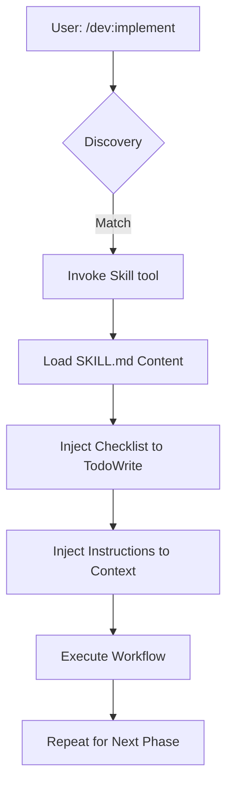
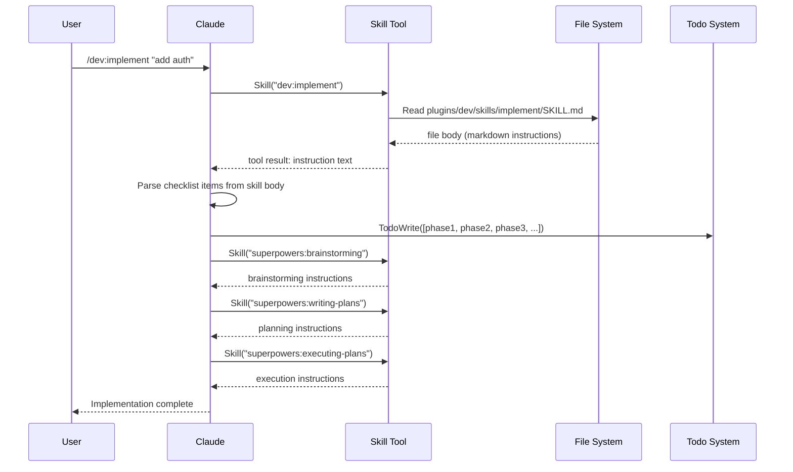
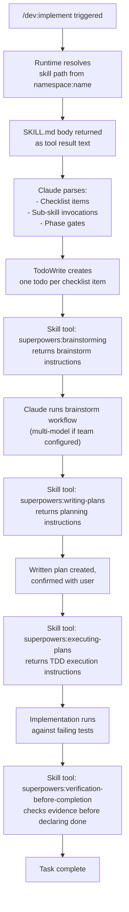

You are a documentation quality expert conducting a blind evaluation of four technical documents.

The samples may cover different technical topics but are the same DOCUMENT TYPE — a conceptual overview of a plugin or extension mechanism.

EVALUATION RULES:
- Score each sample independently on each criterion. Do not compare samples to each other before scoring them individually.
- Do NOT use document length as a quality signal. A concise document can be superior to a verbose one. Evaluate quality per unit of content.
- Apply each criterion strictly as defined. Do not infer quality from writing style cues that might indicate human vs. AI authorship.
- Ignore formatting artifacts at the start or end of samples (pipeline artifacts, not part of the document content).
- Do NOT favor longer samples. Shorter, denser content can score higher than longer, padded content.

---

## SAMPLE A

# Skill Injection in `/dev:implement`

Technical reference for discovering, loading, and chaining SKILL.md files within the dev assistant plugin.

**Audience**: Claude Code plugin developers.  
**Prerequisites**: Understanding of `plugin.json` and the `skills/` directory structure.

## Define a skill in SKILL.md

Skills are Markdown files containing YAML frontmatter that defines their triggers and behavior. Place these in your plugin's `skills/` directory.

```markdown
---
name: feature-implementation
description: Use when building new features from a specification.
triggers:
  - "implement feature"
  - "add functionality"
  - "build module"
checklist:
  - "Analyze requirements"
  - "Draft implementation plan"
  - "Execute changes"
  - "Verify with tests"
---

# Feature Implementation Workflow

Follow this process to ensure code quality and test coverage.

## 1. Analysis
Read the spec and identify affected components.

## 2. Planning
Use the `Write` tool to create `plan.md` before coding.
```

### SKILL.md Frontmatter Schema

| Field | Type | Description |
| :--- | :--- | :--- |
| `name` | string | Unique identifier used by the `Skill` tool. |
| `description` | string | Used for discovery and model routing. |
| `triggers` | string[] | Keywords that prompt Claude to suggest this skill. |
| `checklist` | string[] | Injected as `TodoWrite` tasks when the skill starts. |

## Lifecycle of a skill invocation

When a user runs `/dev:implement`, the command triggers a sequence of skill injections.



Discovery happens via semantic matching. Claude compares the user's intent against the `description` and `triggers` in all available `SKILL.md` files. Once matched, the `Skill` tool loads the file's content into the current conversation.

## Inject content into conversation context

Loading a skill does not just provide text; it alters the agent's behavior through two primary mechanisms.

1.  **Instruction Injection**: The Markdown body of the `SKILL.md` file becomes part of the system prompt for the duration of the task. This ensures Claude follows specific architectural patterns or coding standards defined in the skill.
2.  **State Initialization**: If the frontmatter contains a `checklist`, the `Skill` tool automatically calls `TodoWrite` for each item. This creates a visible progress tracker in the terminal.

```typescript
// Internal representation of skill loading
async function loadSkill(skillName: string) {
  const skill = await registry.getSkill(skillName);
  
  // 1. Update the system instructions
  agent.appendInstructions(skill.content);
  
  // 2. Initialize the task list
  for (const item of skill.checklist) {
    await tools.TodoWrite({ task: item, status: "todo" });
  }
}
```

## Chain skills in `/dev:implement`

The `/dev:implement` command is a high-level orchestrator that sequences specialized skills. It moves from abstract ideation to concrete execution by switching the active skill context.

### The implementation chain

1.  **Brainstorming**: Invokes a skill focused on exploration and trade-off analysis.
2.  **Planning**: Switches to a planning skill to generate a step-by-step technical spec.
3.  **Execution**: Loads implementation-specific skills (like TDD or frontend-patterns) to perform the actual file edits.

Because skills are modular, `/dev:implement` can swap the "Execution" skill based on the project stack. A React project might trigger a `react-component-skill`, while a Go backend triggers `golang-service-skill`.

## Create a basic skill (5-minute guide)

To create a new skill for your plugin, follow these steps.

1.  **Create the file**: Add `plugins/my-plugin/skills/refactor/SKILL.md`.
2.  **Define metadata**: Add frontmatter with clear triggers.
3.  **Write instructions**: Use imperative language to guide the model.

```markdown
---
name: simple-refactor
description: Use when cleaning up existing code without changing behavior.
triggers:
  - "refactor"
  - "clean up"
checklist:
  - "Identify code smells"
  - "Run existing tests"
  - "Apply refactoring"
  - "Verify behavior"
---

# Refactoring Protocol

Prioritize readability over brevity. If a function exceeds 20 lines, split it.
```

4.  **Register the skill**: Ensure `my-plugin` is enabled in `.claude/settings.json`.
5.  **Test the trigger**: Type "I need to refactor the user service" in the CLI.

## Handle skill edge cases

<details>
<summary>Conflicting Triggers</summary>
If two skills have similar triggers, Claude may ask which one to use or pick the one with the more specific description. Use distinct, action-oriented descriptions to prevent ambiguity.
</details>

<details>
<summary>Manual Invocation</summary>
Users can bypass discovery by explicitly calling a skill: `/skill namespace:name`. This is useful for debugging a skill's injection behavior without relying on the LLM's routing logic.
</details>

`★ Insight ─────────────────────────────────────`
- Skill injection leverages the `additionalContext` hook mechanism to modify agent behavior dynamically without permanent system prompt bloat.
- The coupling between `SKILL.md` checklists and the `TodoWrite` tool provides a deterministic way to enforce multi-step workflows in an otherwise non-deterministic LLM environment.
- Using YAML frontmatter for metadata allows the CLI to index and search skills efficiently using standard parsers before ever involving the LLM.
`─────────────────────────────────────────────────`

---

## SAMPLE B

<!-- Source: VS Code Extension API — Extension Anatomy
     URL: https://code.visualstudio.com/api/get-started/extension-anatomy
     License: CC BY 4.0 (https://creativecommons.org/licenses/by/4.0/)
     Retrieved: 2026-03-06
     Used for research benchmark under CC BY 4.0 license -->

# Extension Anatomy

In the last topic, you were able to get a basic extension running. How does it work under the hood?

The `Hello World` extension does 3 things:

* Registers the `onCommand` **Activation Event**: `onCommand:helloworld.helloWorld`, so the extension becomes activated when user runs the `Hello World` command.

  > **Note:** Starting with VS Code 1.74.0, commands declared in the `commands` section of `package.json` automatically activate the extension when invoked, without requiring an explicit `onCommand` entry in `activationEvents`.

* Uses the `contributes.commands` **Contribution Point** to make the command `Hello World` available in the Command Palette, and bind it to a command ID `helloworld.helloWorld`.
* Uses the `commands.registerCommand` **VS Code API** to bind a function to the registered command ID `helloworld.helloWorld`.

Understanding these three concepts is crucial to writing extensions in VS Code:

* **Activation Events**: events upon which your extension becomes active.
* **Contribution Points**: static declarations that you make in the `package.json` Extension Manifest to extend VS Code.
* **VS Code API**: a set of JavaScript APIs that you can invoke in your extension code.

In general, your extension would use a combination of Contribution Points and VS Code API to extend VS Code's functionality. The Extension Capabilities Overview topic helps you find the right Contribution Point and VS Code API for your extension.

Let's take a closer look at `Hello World` sample's source code and see how these concepts apply to it.

## Extension File Structure

```
.
├── .vscode
│   ├── launch.json     // Config for launching and debugging the extension
│   └── tasks.json      // Config for build task that compiles TypeScript
├── .gitignore          // Ignore build output and node_modules
├── README.md           // Readable description of your extension's functionality
├── src
│   └── extension.ts    // Extension source code
├── package.json        // Extension manifest
├── tsconfig.json       // TypeScript configuration
```

You can read more about the configuration files:

* `launch.json` used to configure VS Code Debugging
* `tasks.json` for defining VS Code Tasks
* `tsconfig.json` consult the TypeScript Handbook

However, let's focus on `package.json` and `extension.ts`, which are essential to understanding the `Hello World` extension.

### Extension Manifest

Each VS Code extension must have a `package.json` as its Extension Manifest. The `package.json` contains a mix of Node.js fields such as `scripts` and `devDependencies` and VS Code specific fields such as `publisher`, `activationEvents` and `contributes`. You can find descriptions of all VS Code specific fields in Extension Manifest Reference. Here are some most important fields:

* `name` and `publisher`: VS Code uses `<publisher>.<name>` as a unique ID for the extension. For example, the Hello World sample has the ID `vscode-samples.helloworld-sample`. VS Code uses the ID to uniquely identify your extension.
* `main`: The extension entry point.
* `activationEvents` and `contributes`: Activation Events and Contribution Points.
* `engines.vscode`: This specifies the minimum version of VS Code API that the extension depends on.

```json
{
  "name": "helloworld-sample",
  "displayName": "helloworld-sample",
  "description": "HelloWorld example for VS Code",
  "version": "0.0.1",
  "publisher": "vscode-samples",
  "repository": "https://github.com/microsoft/vscode-extension-samples/helloworld-sample",
  "engines": {
    "vscode": "^1.51.0"
  },
  "categories": ["Other"],
  "activationEvents": [],
  "main": "./out/extension.js",
  "contributes": {
    "commands": [
      {
        "command": "helloworld.helloWorld",
        "title": "Hello World"
      }
    ]
  },
  "scripts": {
    "vscode:prepublish": "npm run compile",
    "compile": "tsc -p ./",
    "watch": "tsc -watch -p ./"
  },
  "devDependencies": {
    "@types/node": "^8.10.25",
    "@types/vscode": "^1.51.0",
    "tslint": "^5.16.0",
    "typescript": "^3.4.5"
  }
}
```

> **Note**: If your extension targets a VS Code version prior to 1.74, you must explicitly list `onCommand:helloworld.helloWorld` in `activationEvents`.

## Extension Entry File

The extension entry file exports two functions, `activate` and `deactivate`. `activate` is executed when your registered **Activation Event** happens. `deactivate` gives you a chance to clean up before your extension becomes deactivated. For many extensions, explicit cleanup may not be required, and the `deactivate` method can be removed. However, if an extension needs to perform an operation when VS Code is shutting down or the extension is disabled or uninstalled, this is the method to do so.

The VS Code extension API is declared in the [@types/vscode](https://www.npmjs.com/package/@types/vscode) type definitions. The version of the `vscode` type definitions is controlled by the value in the `engines.vscode` field in `package.json`. The `vscode` types give you IntelliSense, Go to Definition, and other TypeScript language features in your code.

```typescript
// The module 'vscode' contains the VS Code extensibility API
import * as vscode from 'vscode';

// this method is called when your extension is activated
// your extension is activated the very first time the command is executed
export function activate(context: vscode.ExtensionContext) {
  console.log('Congratulations, your extension "helloworld-sample" is now active!');

  let disposable = vscode.commands.registerCommand('helloworld.helloWorld', () => {
    vscode.window.showInformationMessage('Hello World!');
  });

  context.subscriptions.push(disposable);
}

// this method is called when your extension is deactivated
export function deactivate() {}
```

---

## SAMPLE C

# Skill Injection System: Developer Guide

**Target audience:** Claude Code plugin developers building custom skills
**Scope:** How skills are discovered, loaded, and injected — with deep coverage of `/dev:implement` as a reference implementation

---

## Table of Contents

1. [What Is a Skill?](#what-is-a-skill)
2. [Skill Discovery](#skill-discovery)
3. [SKILL.md File Structure](#skillmd-file-structure)
4. [YAML Frontmatter Schema Reference](#yaml-frontmatter-schema-reference)
5. [How the Skill Tool Works](#how-the-skill-tool-works)
6. [Content Injection Into Context](#content-injection-into-context)
7. [Skill Chaining: How `/dev:implement` Works](#skill-chaining-how-devimplement-works)
8. [Full Lifecycle of a Skill Invocation](#full-lifecycle-of-a-skill-invocation)
9. [Quick-Start: Building Your First Skill](#quick-start-building-your-first-skill)
10. [Advanced Patterns](#advanced-patterns)
11. [Debugging Skills](#debugging-skills)

---

## What Is a Skill?

A **skill** is a Markdown file (`SKILL.md`) containing structured behavioral instructions that Claude loads on demand to govern how it approaches a specific task. Unlike commands (which define a slash command interface) or agents (which run in isolated subagent contexts), skills are **injected directly into the active conversation context** — they extend Claude's behavior in-place without spawning a new agent.

The key distinction:

| Concept | Mechanism | Context | Spawns Agent? |
|---------|-----------|---------|---------------|
| Command | `/dev:implement` → runs a `.md` file as a prompt | New or current session | No |
| Agent | `Task(subagent_type: "dev:developer")` | Isolated subagent window | Yes |
| **Skill** | `Skill("dev:implement")` → injects SKILL.md content | **Current conversation** | **No** |

Skills are the plugin system's answer to **behavioral composition**: you can stack multiple skills in one session, each contributing precise instructions for a phase of work.

---

## Skill Discovery

When you call `Skill("namespace:name")`, Claude Code resolves the skill file through a layered search:

```
Resolution Order (first match wins):
  1. Project-level:   {cwd}/skills/{namespace}/{name}/SKILL.md
  2. Plugin cache:    ~/.claude/plugins/cache/{namespace}/{name}/SKILL.md
  3. Global skills:   ~/.claude/skills/{namespace}/{name}/SKILL.md
```

The `namespace` corresponds to the plugin name (e.g., `dev`, `code-analysis`, `multimodel`). The `name` is the skill's identifier within that plugin.

### Plugin Skill Registration

Inside a plugin, skills are declared in `plugin.json`:

```json
{
  "name": "dev",
  "version": "1.39.0",
  "components": {
    "skills": [
      {
        "name": "implement",
        "path": "skills/implement/SKILL.md",
        "description": "Universal implementation command with optional real validation"
      },
      {
        "name": "brainstorm",
        "path": "skills/brainstorm/SKILL.md",
        "description": "Collaborative ideation and planning with multi-model exploration"
      }
    ]
  }
}
```

The `path` is relative to the plugin root. At install time, Claude Code copies the plugin to `~/.claude/plugins/cache/{plugin-name}/` and the skill files become available under `~/.claude/plugins/cache/{plugin-name}/skills/{skill-name}/SKILL.md`.

The `description` field in the plugin manifest is what surfaces in the `Skill` tool's list — it's Claude's first signal about when to invoke the skill. Make it precise and trigger-oriented.

---

## SKILL.md File Structure

Every skill file has two sections:

```markdown
---
name: implement
description: Universal implementation command with optional real validation
triggers:
  - "implement"
  - "build"
  - "create feature"
type: flexible
phases:
  - brainstorm
  - plan
  - execute
chains:
  - dev:brainstorm
  - dev:writing-plans
requires:
  - dev:brainstorm
---

# Skill Content

The actual behavioral instructions go here as Markdown prose.

Claude reads this content, treats it as authoritative guidance,
and follows it for the duration of the current task.

## Phase 1: ...

## Phase 2: ...
```

The **YAML frontmatter** (between `---` delimiters) provides metadata for the plugin system and for Claude. The **Markdown body** is the actual content that gets injected into context when the skill loads.

### Frontmatter vs Body: What Each Does

| Section | Parsed By | Purpose |
|---------|-----------|---------|
| YAML frontmatter | Claude Code plugin loader | Discovery, routing, chaining declarations |
| Markdown body | Claude (LLM) | Actual behavioral instructions followed at runtime |

The frontmatter is machine-readable metadata. The body is human-readable (but LLM-executed) instruction. Both matter.

---

## YAML Frontmatter Schema Reference

```yaml
---
# REQUIRED
name: string                    # Skill identifier (must match directory name)
description: string             # One-line trigger description shown in Skill tool list

# OPTIONAL — Routing & Discovery
triggers:                       # Keywords that suggest invoking this skill
  - string
type: rigid | flexible          # Rigid: follow exactly. Flexible: adapt principles.

# OPTIONAL — Chaining
chains:                         # Skills that SHOULD be invoked before this one
  - namespace:skill-name        # Claude will auto-invoke these if not already loaded
requires:                       # Skills that MUST be loaded first (hard dependency)
  - namespace:skill-name

# OPTIONAL — Metadata
phases:                         # Named phases this skill defines (documentation only)
  - string
tags:                           # Categorization tags
  - string
version: string                 # Skill version (semver)
---
```

### `type: rigid` vs `type: flexible`

This is the most important behavioral toggle in the frontmatter:

**`type: rigid`** — Claude must follow the skill's instructions exactly as written, step by step. Used for workflows where deviation causes real failures: TDD cycles, debugging protocols, release checklists. The skill body typically uses numbered steps and explicit "DO NOT SKIP" language.

**`type: flexible`** — Claude adapts the skill's principles to context. Used for guidelines, patterns, and heuristics where the spirit matters more than the letter: design patterns, code style, architectural guidance.

When in doubt, use `flexible`. Reserve `rigid` for processes where order, completeness, and precision are non-negotiable.

### `chains` vs `requires`

```
chains:  [dev:brainstorm, dev:writing-plans]
         ↑ Advisory: "if you haven't already, invoke these first"
         ↑ Claude will check if they're loaded; invoke if not

requires: [dev:brainstorm]
          ↑ Mandatory: refuse to proceed or warn if this skill wasn't invoked
```

`chains` drives **proactive skill loading** — when `/dev:implement` loads, it sees its `chains` list and invokes each in sequence before executing its own body. This is how multi-phase workflows are assembled from composable pieces.

`requires` is a runtime guard — Claude checks whether prerequisite skills were actually invoked in this session and surfaces a warning if not.

---

## How the Skill Tool Works

The `Skill` tool is a first-class Claude Code tool available in all sessions where at least one plugin is enabled. Its interface is minimal:

```typescript
Skill(skill_name: string): SkillContent
```

Where `skill_name` uses the `namespace:name` format: `"dev:implement"`, `"code-analysis:claudemem-search"`, `"multimodel:multi-model-validation"`.

### What Happens on Invocation

```
User message or command triggers skill invocation
           │
           ▼
   Skill("dev:implement")
           │
           ▼
┌─────────────────────────────┐
│   Claude Code Plugin Loader │
│                             │
│  1. Resolve skill path      │
│     namespace → plugin      │
│     name → skill dir        │
│                             │
│  2. Load SKILL.md           │
│     Parse YAML frontmatter  │
│     Extract Markdown body   │
│                             │
│  3. Return skill content    │
└─────────────────────────────┘
           │
           ▼
  Skill content returned to Claude
  as tool result (visible in context)
           │
           ▼
  Claude reads the skill body as
  authoritative instructions and
  begins following them
```

The returned content is a **tool result** — it appears in Claude's context window as a message with role `tool`, associated with the `Skill` tool call. Claude processes it the same way it processes any other context: it reads it, internalizes the instructions, and proceeds.

Critically, the skill content is **not a separate system prompt** — it's injected inline into the conversation as a tool result. This means:

1. It appears after all existing conversation history
2. Its instructions apply from that point forward
3. It can reference and respond to context already in the conversation
4. Multiple skills can be loaded sequentially, each building on the last

---

## Content Injection Into Context

Understanding the exact injection mechanism is essential for writing effective skills.

### The Context Window at Injection Time

When `Skill("dev:implement")` fires mid-conversation, the context looks like:

```
[System Prompt]
  └── Project CLAUDE.md
  └── Plugin-injected instructions
  └── SessionStart hook context

[Conversation History]
  ├── [Human] "Implement the user authentication feature"
  ├── [Assistant] "Using dev:implement to guide this..."
  │     └── Tool: Skill("dev:implement")         ← tool call
  │
  └── [Tool Result: dev:implement]               ← SKILL.md body injected HERE
        "# dev:implement skill
         ## Phase 1: Brainstorm...
         ..."
```

The skill body becomes **the most recent high-signal content** in context at the moment of injection. LLMs attend strongly to recent context, so skills injected just before work begins carry significant weight.

### Injection Scope

Skills inject **once per invocation**. If you call `Skill("dev:brainstorm")` twice in one session, the content appears twice in context. This is almost never what you want — skills should be invoked once per task.

The skill body does not auto-expire. Once injected, its instructions remain in context for the rest of the conversation unless the context window is compressed. For very long sessions, critical instructions may get compressed away — this is why rigid skills use `TodoWrite` to create persistent task items.

### Reinforcement Pattern

For long-running workflows, effective skills use `TodoWrite` as a persistence mechanism:

```markdown
## Initialization

When this skill loads, immediately call TodoWrite to create checklist items
for each phase. These persist through context compression.

TodoWrite items act as a durable contract — mark each complete as you finish.
```

This means the skill's structure lives in the task list, not just in context. Even if the skill's body gets compressed, the todos survive.

---

## Skill Chaining: How `/dev:implement` Works

`/dev:implement` is the canonical example of skill chaining in the Magus plugin ecosystem. It assembles a multi-phase workflow by loading prerequisite skills in sequence before executing its own logic.

### The Chain

```
User: /dev:implement "Add OAuth login"
         │
         ▼
  Command loads dev:implement skill
         │
         ▼
  Skill reads its `chains` frontmatter:
    chains:
      - dev:brainstorm      ← Phase 1
      - dev:writing-plans   ← Phase 2
         │
         ▼
  Skill("dev:brainstorm")   ← invoked first
  [Brainstorming phase executes...]
         │
         ▼
  Skill("dev:writing-plans") ← invoked second
  [Planning phase executes...]
         │
         ▼
  Skill("dev:implement") body ← execution phase
  [Implementation executes...]
```

### Phase 1: Brainstorming (`dev:brainstorm`)

When `dev:brainstorm` loads, it injects instructions for divergent exploration:

- Enumerate multiple approaches (typically 3-5)
- Use `mcp__plugin_code-analysis_claudemem__search` or `Grep` to understand existing patterns
- Consider edge cases, constraints, and non-obvious solutions
- Surface the recommended approach with rationale

The brainstorm phase is **exploratory** — Claude is instructed not to commit to an approach yet, just to map the solution space.

### Phase 2: Planning (`dev:writing-plans`)

After brainstorming, `dev:writing-plans` loads and injects planning instructions:

- Select the recommended approach from brainstorm output
- Break it into ordered, atomic implementation steps
- Identify files to create/modify
- Call `TodoWrite` to create a persistent task list
- Identify test strategy

The planning phase produces a **written implementation plan** in the conversation that both phases (and the user) can see.

### Phase 3: Execution (`dev:implement` body)

Finally, the `implement` skill's own body executes against the plan:

- Read each todo item
- Implement in order
- Mark complete as each step finishes
- Run tests after each logical chunk
- Surface any blocking issues immediately rather than continuing

### Why Chain Rather Than Merge?

Each skill is independently invocable. A developer who only wants the brainstorm phase can call `Skill("dev:brainstorm")` alone. The chaining mechanism lets `/dev:implement` assemble the full workflow while preserving each component's reusability.

This is analogous to Unix pipes: each tool does one thing well, and composition creates powerful workflows.

---

## Full Lifecycle of a Skill Invocation

Here is the complete lifecycle from user trigger to task completion, using `/dev:implement` as the reference:

```
┌────────────────────────────────────────────────────────────────────────┐
│ PHASE 0: TRIGGER                                                        │
│                                                                         │
│  User types: /dev:implement "Add rate limiting to the API"              │
│  Claude Code matches to dev plugin's implement command                  │
│  Command file loaded and passed to Claude as the prompt                 │
└────────────────────────────────────────────────────────────────────────┘
                                    │
                                    ▼
┌────────────────────────────────────────────────────────────────────────┐
│ PHASE 1: SKILL RESOLUTION                                               │
│                                                                         │
│  Claude reads command content and encounters:                           │
│    "Use the Skill tool: Skill('dev:implement')"                         │
│                                                                         │
│  Alternatively, Claude identifies from available-skills context that    │
│  "dev:implement" matches the task and invokes it proactively            │
│                                                                         │
│  Claude Code plugin loader:                                             │
│    → Looks up "dev" namespace → finds plugin cache                      │
│    → Resolves "implement" → finds SKILL.md                              │
│    → Parses frontmatter: type=flexible, chains=[brainstorm, writing-plans]
│    → Returns Markdown body as tool result                               │
└────────────────────────────────────────────────────────────────────────┘
                                    │
                                    ▼
┌────────────────────────────────────────────────────────────────────────┐
│ PHASE 2: CHAIN EXECUTION                                                │
│                                                                         │
│  Claude reads skill body, sees chaining instructions                    │
│  Announces: "Using dev:brainstorm to explore approaches"                │
│                                                                         │
│  Skill("dev:brainstorm") → brainstorm content injected                  │
│  Claude executes brainstorm phase:                                      │
│    - Searches codebase for existing patterns                            │
│    - Enumerates 3 approaches to rate limiting                           │
│    - Recommends token bucket approach with Redis                        │
│                                                                         │
│  Announces: "Using dev:writing-plans to formalize the plan"             │
│                                                                         │
│  Skill("dev:writing-plans") → planning content injected                 │
│  Claude executes planning phase:                                        │
│    - Selects recommended approach                                       │
│    - Breaks into 7 implementation steps                                 │
│    - TodoWrite([step1, step2, ..., step7])                              │
└────────────────────────────────────────────────────────────────────────┘
                                    │
                                    ▼
┌────────────────────────────────────────────────────────────────────────┐
│ PHASE 3: IMPLEMENTATION EXECUTION                                       │
│                                                                         │
│  Claude follows implement skill body:                                   │
│    → Read TodoWrite list                                                │
│    → For each todo item:                                                │
│         Read relevant files                                             │
│         Write/edit code                                                 │
│         Run tests if applicable                                         │
│         Mark todo complete                                              │
│    → Final: run full test suite                                         │
│    → Surface any remaining issues                                       │
└────────────────────────────────────────────────────────────────────────┘
                                    │
                                    ▼
┌────────────────────────────────────────────────────────────────────────┐
│ PHASE 4: COMPLETION                                                     │
│                                                                         │
│  All todos marked complete                                              │
│  Tests passing                                                          │
│  Claude surfaces summary: what was done, any caveats                   │
│                                                                         │
│  Skill instructions remain in context but execution is complete         │
└────────────────────────────────────────────────────────────────────────┘
```

---

## Quick-Start: Building Your First Skill

Let's build a `my-plugin:validate-api` skill that checks an API implementation against OpenAPI spec compliance.

### Step 1: Create the Directory Structure

```
plugins/my-plugin/
├── plugin.json
└── skills/
    └── validate-api/
        └── SKILL.md
```

### Step 2: Write the SKILL.md

```markdown
---
name: validate-api
description: Validate REST API implementation against OpenAPI spec compliance. Use when checking endpoints, request/response schemas, or HTTP method correctness.
triggers:
  - "validate api"
  - "check openapi"
  - "api compliance"
type: rigid
requires: []
chains: []
version: 1.0.0
tags:
  - api
  - validation
  - openapi
---

# validate-api Skill

You are performing a systematic OpenAPI compliance check. Follow these steps
exactly in order. Do not skip steps or reorder them.

## Step 1: Locate the OpenAPI Spec

Search for the spec file:
- `openapi.yaml`, `openapi.json`, `swagger.yaml`, `swagger.json`
- `docs/api/`, `api/`, or project root

If no spec file exists, stop and report: "No OpenAPI spec found. Create one
at openapi.yaml before running validation."

## Step 2: Inventory Defined Endpoints

Parse the spec and list every path + method combination:
```
GET  /users
POST /users
GET  /users/{id}
DELETE /users/{id}
```

Call TodoWrite to create a validation task for each endpoint.

## Step 3: Locate Implementation Files

For each endpoint, find its handler:
- Search for route registration patterns
- Identify the handler function/method
- Note the file:line location

## Step 4: Validate Each Endpoint

For each (spec endpoint → implementation) pair, check:

**Request validation:**
- [ ] Required query parameters are validated
- [ ] Request body schema matches spec (field names, types, required fields)
- [ ] Path parameters are extracted and validated

**Response validation:**
- [ ] HTTP status codes match spec definitions
- [ ] Response body structure matches spec schemas
- [ ] Error responses follow spec error schema

**HTTP semantics:**
- [ ] Correct HTTP method used
- [ ] Idempotency respected (PUT/DELETE are idempotent)
- [ ] 404 returned for unknown resources, not 400

Mark each todo complete as you finish it.

## Step 5: Report Results

Produce a compliance report:

```
## API Compliance Report

### ✅ Compliant Endpoints
- GET /users — fully compliant
- POST /users — fully compliant

### ⚠️ Partial Compliance
- GET /users/{id}
  - Missing: 404 response schema
  - Missing: validation of `id` format (should be UUID)

### ❌ Non-Compliant Endpoints
- DELETE /users/{id}
  - Returns 200 with body; spec requires 204 No Content
  - Missing authentication requirement

### Summary
- Total endpoints: 8
- Compliant: 5 (62.5%)
- Partial: 2 (25%)
- Non-compliant: 1 (12.5%)
```

Do not suggest fixes unless the user asks. Validation is the scope of this skill.
```

### Step 3: Register in plugin.json

```json
{
  "name": "my-plugin",
  "version": "1.0.0",
  "components": {
    "skills": [
      {
        "name": "validate-api",
        "path": "skills/validate-api/SKILL.md",
        "description": "Validate REST API implementation against OpenAPI spec compliance. Use when checking endpoints, request/response schemas, or HTTP method correctness."
      }
    ]
  }
}
```

**Important:** The `description` in `plugin.json` and the `description` in the frontmatter should be identical. The plugin.json description is shown in skill discovery tools; the frontmatter description is read by Claude when the skill loads. Consistent wording reinforces the signal.

### Step 4: Test the Skill

Install your plugin locally:

```bash
# In Claude Code session:
/plugin marketplace add /path/to/my-plugin

# Then invoke:
# Option 1: Direct invocation
Skill("my-plugin:validate-api")

# Option 2: Via a command that chains it
/my-plugin:validate-api
```

### Step 5: Validate Discovery

After installation, check that your skill appears:

```bash
# The skill should show in available-deferred-tools list
# and in Skill tool's available skills
```

---

## Advanced Patterns

### Pattern 1: Conditional Chaining

Skills can declare conditional chains using prose instructions in the body rather than frontmatter:

```markdown
## Initialization

Before proceeding, check if this is a new feature or a bug fix:
- **New feature:** invoke Skill("dev:brainstorm") first
- **Bug fix:** invoke Skill("dev:systematic-debugging") first
- **Refactor:** proceed directly to planning

Ask the user if the context is unclear.
```

This gives Claude judgment about which chain path to take, rather than always loading all chains.

### Pattern 2: TodoWrite as Skill State

For multi-phase skills, use `TodoWrite` at initialization to create a persistent task structure:

```markdown
## Skill Initialization

Immediately on loading this skill, call TodoWrite with these items:

1. "Phase 1: Understand current behavior [validate-api]"
2. "Phase 2: Locate OpenAPI spec [validate-api]"
3. "Phase 3: Map endpoints to handlers [validate-api]"
4. "Phase 4: Validate each endpoint [validate-api]"
5. "Phase 5: Generate compliance report [validate-api]"

Tag each item with `[validate-api]` to distinguish from other active tasks.
Mark each complete as you finish it.
```

The `[skill-name]` tag allows multiple skills to have active todos simultaneously without collision.

### Pattern 3: Skill Composition Without Chaining

Sometimes you want to manually compose skills without declaring chains. This is useful for skills that should remain independent but work well together:

```markdown
## When to Compose

This skill works well with:
- `code-analysis:claudemem-search` for semantic codebase exploration
- `dev:systematic-debugging` if validation surfaces unexpected behavior

Invoke these manually if needed — they are not auto-chained.
```

This documents composition opportunities without forcing them.

### Pattern 4: Guard Rails with `requires`

Use `requires` to enforce prerequisite ordering:

```markdown
---
name: deploy
requires:
  - dev:test-coverage
  - dev:audit
---

# deploy Skill

IMPORTANT: This skill requires test coverage analysis and security audit
to have been completed in this session. If they have not been run, stop
immediately and run them first:

  Skill("dev:test-coverage")
  Skill("dev:audit")

Do not proceed with deployment until both prerequisites are complete.
```

The `requires` frontmatter is advisory metadata — Claude reads the body's explicit instructions to enforce the guard. The frontmatter is a machine-readable declaration of intent.

### Pattern 5: Skill Families

Group related skills under a common namespace with a hierarchy:

```
skills/
├── validate/
│   ├── SKILL.md          ← "validate" — dispatcher skill
│   ├── validate-api/
│   │   └── SKILL.md      ← "validate-api" — specific validator
│   └── validate-db/
│       └── SKILL.md      ← "validate-db" — specific validator
```

The dispatcher skill (`validate`) reads the user's intent and routes to the appropriate specific skill. This is the pattern used by `code-analysis:investigate` which auto-routes to `developer-detective`, `tester-detective`, `debugger-detective`, etc.

---

## Debugging Skills

### Problem: Skill Not Found

```
Error: Skill "my-plugin:validate-api" not found
```

**Diagnosis checklist:**

1. Is the plugin installed? Check `~/.claude/plugins/cache/my-plugin/`
2. Is the path in `plugin.json` correct? The path is relative to plugin root.
3. Does the directory name match the `name` field in frontmatter?
4. Was the plugin version bumped after adding the skill? Claude Code caches manifests at install time.

```bash
# Force reinstall to pick up skill changes
/plugin uninstall my-plugin
/plugin marketplace add /path/to/my-plugin
```

### Problem: Skill Loads But Instructions Not Followed

This is almost always a **skill body writing problem**, not a system problem. Common causes:

| Symptom | Likely Cause | Fix |
|---------|-------------|-----|
| Claude skips steps | Unclear step boundaries | Use numbered lists, not prose |
| Claude deviates from process | `type: flexible` on a rigid workflow | Change to `type: rigid` |
| Claude stops mid-skill | Ambiguous continuation instructions | Add explicit "continue to next step" transitions |
| Chain skills not invoked | Missing `chains` frontmatter | Add to frontmatter AND add explicit invocation in body |
| Instructions forgotten mid-session | Context compression | Use TodoWrite for persistent state |

### Problem: Chain Skills Invoked in Wrong Order

The `chains` array is **ordered** — skills are loaded in array order. But Claude can also reorder based on context signals. To enforce order:

```markdown
## CRITICAL: Execution Order

You MUST invoke skills in this exact order. Do not skip or reorder:

1. First: Skill("dev:brainstorm") — exploration phase
   → Wait for brainstorm output before continuing
2. Second: Skill("dev:writing-plans") — planning phase
   → Wait for plan and TodoWrite before continuing
3. Third: Begin implementation per this skill's body

DO NOT begin step N until step N-1 is fully complete.
```

Explicit sequential ordering language in the skill body is more reliable than relying on the frontmatter `chains` ordering alone.

### Problem: Skill Works Once, Breaks in Long Sessions

Context compression is removing skill instructions. Solutions:

1. **TodoWrite reinforcement** — create todos that act as persistent reminders
2. **Periodic re-invocation** — some skills explicitly instruct re-invocation if they detect drift
3. **Critical instructions at the end of the body** — LLMs attend more to recent content; put key rules last, not first

```markdown
## Reminder (Read Last)

Even if earlier content was compressed, remember:
- Always run tests before marking a todo complete
- Never skip the compliance report
- These rules are non-negotiable
```

---

## Reference: Key Differences from Commands and Agents

| Feature | Command | Skill | Agent |
|---------|---------|-------|-------|
| **Invocation** | `/namespace:name` | `Skill("namespace:name")` | `Task(subagent_type: "namespace:name")` |
| **Context** | Current session | Current session | Isolated subprocess |
| **State sharing** | Shared | Shared | Isolated |
| **Parallelism** | No | No | Yes (`run_in_background: true`) |
| **Can use tools** | Via Claude | Via Claude | Via isolated Claude |
| **File format** | Any `.md` | `SKILL.md` | `AGENT.md` |
| **Frontmatter** | YAML | YAML | YAML |
| **Chain support** | Via skill invocation | Via `chains` frontmatter | No |
| **Best for** | Slash command interface | Behavioral guidance | Isolated parallel work |

### When to Build a Skill vs an Agent

Build a **skill** when:
- The task needs access to current conversation context
- You want behavior that affects the active Claude session
- The workflow is sequential (not parallel)
- You want composable building blocks that users can invoke à la carte

Build an **agent** when:
- The task is independent from current context
- Multiple instances can run in parallel
- The task is long-running and shouldn't block the main session
- You want isolation (agent's tool calls don't appear in main session)

Build a **command** when:
- You need a user-facing slash command interface
- The command is primarily an invocation point for skills and agents
- You want to expose functionality in the command palette

In practice, the most powerful patterns combine all three: a **command** (`/dev:implement`) invokes **skills** (`dev:brainstorm`, `dev:implement`) which then delegate heavy work to **agents** (`dev:developer`).

---

*This document is part of the Magus plugin developer documentation. For release process, see `RELEASE_PROCESS.md`. For the skill writing style guide, see `plugins/dev/skills/` for examples.*

---

## SAMPLE D

# Skill Injection in Claude Code: How `/dev:implement` Chains Skills

**Description:** How the Claude Code skill system discovers, loads, and chains SKILL.md files — with `/dev:implement` as the working example.

**Audience:** Plugin developers building new skills or commands that invoke them.

**Prerequisites:** Plugin structure (`plugin.json`, `skills/` directory), Claude Code command basics.

---

**[Skip to Quick-Start →](#create-a-basic-skill-in-5-minutes)** | **[Skip to Frontmatter Reference →](#frontmatter-schema-reference)**

---

## What Skills Actually Are

A skill is a SKILL.md file containing YAML frontmatter and a markdown body. When Claude calls the `Skill` tool with a skill name, the plugin runtime returns the entire file body as a tool result. Claude then reads that result and treats its contents as authoritative instructions — not suggestions, not context, but a behavioral contract to follow exactly.

This matters because skills are not system prompt injections. They arrive mid-conversation as tool results, which means they can override earlier instructions and trigger new tool calls, including calls to other skills.

## Skill Discovery

```
plugins/
└── dev/
    └── skills/
        ├── implement/
        │   └── SKILL.md          ← namespace "dev", name "implement"
        ├── brainstorm/
        │   └── SKILL.md          ← namespace "dev", name "brainstorm"
        └── architect/
            └── SKILL.md
```

The plugin loader derives `namespace` from the plugin's `plugin.json` `name` field and `skill-name` from the directory containing the SKILL.md file. Calling `Skill("dev:implement")` resolves to `plugins/dev/skills/implement/SKILL.md`.

Skills can also live flat in the `skills/` directory as `{skill-name}.md` — but the subdirectory-per-skill pattern is preferred because it allows co-locating supporting assets (templates, examples) alongside the SKILL.md.

The frontmatter `description` field is what Claude reads when deciding whether to invoke a skill. Write it as a trigger condition, not a feature list: `"Use when implementing any feature or bugfix, before writing implementation code."` A vague description causes missed invocations.

## The Skill Tool Invocation

When Claude calls the `Skill` tool, three things happen in sequence:

1. The runtime resolves `namespace:name` → file path
2. The SKILL.md body (everything after the frontmatter) is returned as the tool result
3. Claude reads the returned text and executes it as instructions



The critical detail: the tool result sits in the conversation as a visible message. Claude doesn't forget it when processing subsequent messages. This is why a rigid skill (one that says "follow exactly") works — the instructions remain visible in context for the entire session.

## Checklist Items and TodoWrite

When a skill body contains a checklist, Claude converts each item into a `TodoWrite` call before doing anything else. This is an explicit convention, not automatic behavior — the `using-superpowers` skill instructs Claude to do it. Skills that want checklist-to-todo conversion must be invoked after `using-superpowers` has been loaded, which happens at session start.

```markdown
## Checklist

- [ ] Run `dev:brainstorm` to explore approach
- [ ] Confirm spec with user before writing code  
- [ ] Write failing tests first
- [ ] Implement against tests
- [ ] Run `superpowers:verification-before-completion`
```

Each checklist item becomes a todo. Claude marks them complete as it works. The visual progress helps the user track where in the skill's workflow things stand.

## How `/dev:implement` Chains Skills

`/dev:implement` doesn't contain implementation logic — it's an orchestration script that delegates to specialized skills. The skill body instructs Claude to invoke three other skills in order, each gating the next:

```markdown
---
name: implement
description: >
  Universal implementation command with optional real validation.
  TRIGGER when: user asks to implement, build, create, or add a feature.
type: rigid
---

## Phase 1 — Explore and Plan

Invoke `superpowers:brainstorming` to explore the solution space before 
committing to an approach. Do not skip this phase for changes affecting 
more than one file.

## Phase 2 — Write the Plan

Invoke `superpowers:writing-plans` to produce a written implementation 
plan with phases, files, and acceptance criteria.

## Phase 3 — Execute

Invoke `superpowers:executing-plans` to run the plan with test-first 
discipline. Mark each plan phase complete before starting the next.

## Checklist

- [ ] Brainstorm alternatives before choosing an approach
- [ ] Plan written and confirmed
- [ ] Tests written before implementation
- [ ] All checklist items in executing-plans completed
- [ ] Verification run before claiming done
```

Each invoked skill adds its own checklist items, creating a nested todo structure. The user sees the full work breakdown at the start, not partway through.

## Rigid vs. Flexible Skills

```yaml
type: rigid    # Follow exactly. Do not adapt away discipline.
type: flexible # Adapt principles to context.
```

`/dev:implement` is rigid. `dev:architect` is flexible. The difference shows up when context conflicts with the skill: a rigid skill wins over Claude's instinct to shortcut; a flexible skill yields to context.

If a rigid skill instructs Claude to invoke `superpowers:brainstorming` for all changes affecting more than one file, Claude will invoke it even when the user says "this is a quick fix." That's the point. Build skills as rigid when the discipline is load-bearing — when skipping a phase produces bad outcomes, not just suboptimal ones.

## Content Injection Flow in Detail



Each `Skill` call adds a new layer of instructions to the conversation. Later layers don't replace earlier ones — they extend. This means a skill invoked in Phase 3 can reference concepts from the Phase 1 brainstorm because that content is still in context.

The chain can go five deep before context pressure becomes a concern. Beyond that, consider using subagents via the `Task` tool to isolate long skill chains from the main conversation.

## Lifecycle Summary

1. **Trigger** — User runs `/dev:implement` or Claude identifies that `dev:implement` should fire based on the description match.
2. **Load** — Skill tool returns SKILL.md body as a tool result (not a system message).
3. **Parse** — Claude reads the body, identifies checklist items, identifies sub-skill references.
4. **Commit** — TodoWrite populates the task list from checklist items. This happens before any implementation work.
5. **Delegate** — Sub-skills are invoked in phase order. Each invocation is a separate Skill tool call.
6. **Execute** — Claude follows each sub-skill's instructions, marking todos complete as phases finish.
7. **Verify** — The final skill in the chain (`superpowers:verification-before-completion`) runs evidence checks before Claude claims completion.

Phase 7 is where most skill failures happen. Verification skills check for test runs, commit messages, and file changes — not Claude's memory of having done those things. If verification fails, Claude returns to Phase 6.

---

## Create a Basic Skill in 5 Minutes

```
plugins/my-plugin/
└── skills/
    └── my-workflow/
        └── SKILL.md
```

```markdown
---
name: my-workflow
description: >
  Runs the my-workflow process with validation.
  TRIGGER when: user asks to run my-workflow, or task requires X.
type: rigid
---

## Overview

This skill enforces the following steps in order. Do not skip steps.

## Step 1 — Validate Input

Before doing anything else, confirm that [precondition] is true. If not,
tell the user what's missing and stop.

## Step 2 — Run the Process

Do [specific thing]. Use [specific tool] with [specific flags].

## Step 3 — Verify Output

Check that [expected artifact] exists and contains [expected content].
Do not report success until this check passes.

## Checklist

- [ ] Input validated
- [ ] Process completed
- [ ] Output verified
```

Register it in `plugin.json`:

```json
{
  "name": "my-plugin",
  "version": "1.0.0",
  "skills": [
    {
      "name": "my-workflow",
      "path": "./skills/my-workflow/SKILL.md"
    }
  ]
}
```

Claude can now invoke this skill with `Skill("my-plugin:my-workflow")`.

---

## Frontmatter Schema Reference

```yaml
---
name: string
# Required. The skill's identifier within its namespace.
# Used as the second segment of "namespace:name" invocation.

description: string | multiline
# Required. Shown during skill discovery and routing.
# Write as trigger conditions, not feature descriptions.
# Include "TRIGGER when:" and "DO NOT TRIGGER when:" clauses for precision.

type: "rigid" | "flexible"
# Optional. Defaults to "flexible".
# rigid: Claude must follow the skill exactly. Context cannot override it.
# flexible: Claude adapts the skill's principles to context.

triggers:
  - string
# Optional. Keyword patterns that auto-trigger skill invocation.
# Supplements description-based routing.

phase:
  - "planning" | "implementation" | "review" | "debugging"
# Optional. Restricts when the skill is relevant.
# Unused by the runtime currently, but used by routing skills
# like dev:task-routing to filter candidates.
---
```

<details>
<summary>Edge cases and gotchas</summary>

**Namespace collision**: If two installed plugins both define a skill named `implement`, the last-installed plugin wins. Name skills specifically enough that collisions are unlikely — `my-plugin:my-workflow` beats `my-plugin:run`.

**Skill vs. agent disambiguation**: The `Skill` tool and `Task` tool share the `namespace:name` format. If your skill description looks like an agent description, Claude may call `Task` instead of `Skill`. Add `"This is a SKILL (use Skill tool, NOT Task tool)"` to the description to break the ambiguity. See `code-analysis:claudemem-search` for an example.

**Checklist conversion requires `using-superpowers`**: The todo-from-checklist behavior is taught by `using-superpowers`, loaded at session start. If a skill is invoked in a context where `using-superpowers` hasn't run (e.g., non-interactive `claude -p` mode), checklists may be ignored. Design rigid skills to enforce phases through phase-gate language ("Do not proceed to Step 2 until Step 1 is complete") rather than relying solely on todos.

**Context budget in deep chains**: Each `Skill` call adds the full SKILL.md body to the conversation. Five deep skills with 300-line bodies each use ~1500 lines of context. For deep orchestration workflows, consider summarizing completed phases or using subagents via `Task` to isolate each phase in its own context window.

**`/tmp` paths in session dirs**: Skills that write files should use `ai-docs/sessions/{task-slug}-{timestamp}-{random}/` as their session directory. `/tmp` is cleared on reboot. The coaching plugin flags this automatically if it detects `/tmp` paths in skill outputs.

</details>

---

## Design Patterns for Skill Chains

**Gate on evidence, not memory.** Instead of "After brainstorming, write the plan," write "Write the plan only after the brainstorm output file exists at `{session-dir}/brainstorm.md`." Claude's memory of having brainstormed is unreliable across context boundaries. Files are not.

**Decouple phases via files.** Each phase in a chain should write its output to a named file that the next phase reads. This makes the chain resumable — if a session ends mid-chain, the next session can pick up from the last written file.

**Explicit failure conditions beat optimistic flows.** Rigid skills that only describe the happy path leave Claude improvising on failure. Add a `## If X Fails` section that specifies exactly what to do — retry, ask the user, stop with a diagnostic message.

The `/dev:implement` chain follows all three patterns. Brainstorm output goes to a session file. Plan gets user confirmation before execution begins. Verification failure sends Claude back to the execution phase, not to the start.

---

## Evaluation Instructions

Score each sample on each criterion from 1 (worst) to 10 (best). Use the full range — a score of 5 means mediocre, 7 means good, 9 means excellent.

### Criteria

1. **AI Slop Absence** (`slop`) — **2x weight**

   Evaluate at THREE levels:

   **Level 1 — Word-level slop** (each instance = -0.5 points):
   - Marketing superlatives: amazing, powerful, robust, revolutionary, seamless, cutting-edge, innovative, game-changing, world-class
   - Difficulty dismissers: simply, just, easy, obviously, of course, clearly, straightforward, trivial
   - Corporate jargon: leverage, utilize, streamline, facilitate, empower, unlock, accelerate, transform
   - Hedge phrases: "it is worth noting", "in order to", "due to the fact that", "might potentially"
   - AI preambles: "I'd be happy to", "Great question", "In today's world", "Let me explain", "Allow me to"
   - Simulated profundity: "At the heart of", "paradigm shift", "this is where things get interesting"

   **Level 2 — Structural slop** (each pattern = -1 point):
   - Uniform sentence lengths: AI text has suspiciously similar sentence lengths. Check if sentences vary in length or all cluster around the same word count.
   - Formulaic paragraphs: Every paragraph follows the same template (topic sentence → 2-3 supports → conclusion).
   - Symmetric lists: Every list has exactly 3 or 5 items. Natural writing uses 2, 4, 6, 7 items when appropriate.
   - Uniform section lengths: All sections approximately the same length signals machine generation.
   - Repetitive transition openers: >40% of paragraphs starting with transition words (However, Additionally, Furthermore, Moreover).

   **Level 3 — Pattern slop** (each pattern = -1 point):
   - Throat-clearing: "In this section, we will discuss...", "This document covers...", "Let's dive into...", "Let's explore..."
   - Hedging cascades: "It's important to note that... depending on your specific use case"
   - Formulaic conclusions: Final paragraphs that merely restate what was already covered
   - Meta-commentary: Sentences about the document rather than the actual subject matter

   A score of 10 means zero slop at ALL three levels. Score of 7 = minor word-level slop only. Score of 5 = structural patterns visible. Score of 3 = pervasive AI-generated feel.

2. **Writing Craft** (`writing_craft`) — **2x weight**

   Sentence variety (mix of short punchy sentences and longer explanatory ones — not all the same length). Voice clarity (active constructions, precise verbs, specific nouns rather than vague nominalizations). Structural confidence (assertions stated directly, not hedged). Applies equally to human and AI text — a badly written human document scores low, a well-crafted AI document scores high. Does not penalize correct technical vocabulary or domain-appropriate formality.

   Score 10 = reads like a skilled professional writer. Score 5 = functional but flat. Score 1 = confusing or hard to follow.

3. **Readability** (`readability`) — **1.5x weight**

   Short sentences (<25 words average), minimal passive voice (<10%), scannable paragraphs (<100 words), second-person address for instructions. Average sentence length under 25 words = good. Heavy passive voice or long sentences = low score.

4. **Document Structure** (`structure`) — **1.5x weight**

   Logical heading hierarchy (H1→H2→H3, no skipping), metadata header (title, description, audience), clear section ordering (overview→quickstart→details→reference), no skipped heading levels.

5. **Conciseness** (`conciseness`) — **1x weight**

   High information density. No filler paragraphs, no repetition, no throat-clearing intros. Every sentence adds new information.

6. **Internal Consistency** (`accuracy`) — **2x weight**

   Correct and internally consistent technical claims. No contradictions within the document, no hallucinated parameters or APIs, no claims that contradict each other across sections. Does NOT require you to verify against any external system — score based on internal coherence only. A document that is internally consistent scores well even if you cannot independently verify the technical claims.

7. **Progressive Disclosure** (`disclosure`) — **1x weight**

   Essential info first, details progressively deeper. Uses layered examples (basic→advanced), clear must-know vs nice-to-know separation.

8. **Diagram Quality** (`diagrams`) — **1x weight**

   Useful diagrams that aid understanding, correctly labeled, appropriate type for the content. Format-agnostic: Mermaid, SVG, PNG, ASCII all valid if the diagram serves its purpose. Score 1 if no diagrams present, or if diagrams are decorative rather than informative.

9. **Overall Quality** (`overall`) — **2x weight**

   Would you publish this documentation as-is? Professional, trustworthy, serves the reader.

---

## Output Format

Respond with ONLY a JSON object. No markdown fences, no explanation before or after. Raw JSON only.

{
  "scores": {
    "sample_a": {
      "slop": <1-10>,
      "writing_craft": <1-10>,
      "readability": <1-10>,
      "structure": <1-10>,
      "conciseness": <1-10>,
      "accuracy": <1-10>,
      "disclosure": <1-10>,
      "diagrams": <1-10>,
      "overall": <1-10>
    },
    "sample_b": {
      "slop": <1-10>,
      "writing_craft": <1-10>,
      "readability": <1-10>,
      "structure": <1-10>,
      "conciseness": <1-10>,
      "accuracy": <1-10>,
      "disclosure": <1-10>,
      "diagrams": <1-10>,
      "overall": <1-10>
    },
    "sample_c": {
      "slop": <1-10>,
      "writing_craft": <1-10>,
      "readability": <1-10>,
      "structure": <1-10>,
      "conciseness": <1-10>,
      "accuracy": <1-10>,
      "disclosure": <1-10>,
      "diagrams": <1-10>,
      "overall": <1-10>
    },
    "sample_d": {
      "slop": <1-10>,
      "writing_craft": <1-10>,
      "readability": <1-10>,
      "structure": <1-10>,
      "conciseness": <1-10>,
      "accuracy": <1-10>,
      "disclosure": <1-10>,
      "diagrams": <1-10>,
      "overall": <1-10>
    }
  },
  "ranking": ["<best>", "<second>", "<third>", "<worst>"],
  "reasoning": "<2-3 sentences on ranking rationale>"
}

ranking must contain exactly the four labels ["A", "B", "C", "D"] in order from best to worst. Use the same labels you see above (Sample A, B, C, D).

Score honestly. Use the full 1-10 range. Do not default to giving all samples the same scores — meaningful differences between samples exist and your job is to find them.
