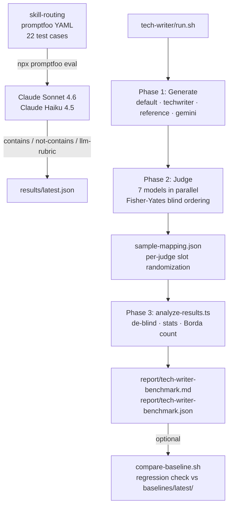

# Architecture

magus-bench measures the quality of the Magus Claude Code plugin ecosystem. It uses LLM-as-judge evaluation — models score other models' outputs against structured rubrics — and an autonomous experiment platform that iterates on benchmark-driving prompts and rubrics until results stop improving.

## The three measurement layers

The infrastructure spans two repositories (`magus-bench` and the sibling `claude-code` repo) and three testing layers at different granularities:

| Layer | Location | Engine | What it measures |
|-------|----------|--------|------------------|
| promptfoo unit | `magus-bench/benchmarks/skill-routing/` | promptfoo + YAML | Prompt-level routing decisions. Does the model pick the right Skill / agent for this prompt? Fast (~2 min) and cheap. |
| autotest integration | `claude-code/autotest/` | `runner-base.sh` + real `claude -p` | End-to-end plugin behavior. Spawns a real Claude Code session with plugins, CLAUDE.md, hooks, and MCP loaded, then inspects JSONL transcripts for correct delegation. |
| tech-writer acceptance | `magus-bench/benchmarks/tech-writer/` | 4-way blind benchmark | Documentation quality. Generates docs four ways, routes to 7 judge models with randomized orderings, computes Borda rankings with statistical tests. 20–40 min, $5–15 per run. |

## How the platform fits in

The three benchmarks above are **instruments** — they each measure one thing and run standalone. The `platform/` directory contains an **experiment orchestrator** that drives these instruments in a closed loop:

```
                ┌─────────────────────────────────────┐
                │   platform/ (orchestrator)          │
                │                                     │
                │   1. Research — propose hypotheses  │
                │   2. Plan — convert to code edits   │
                │   3. Execute — 3 worktrees parallel │
                │   4. Analyze — reviewer agents vote │
                │   5. Decide — deterministic TS      │
                │   6. Journal — append to log        │
                └──────┬──────────────────────────────┘
                       │ spawns (via experiment plugin)
                       ▼
            ┌──────────────────────────┐
            │   benchmarks/<name>/     │  ← measurement layer
            │   (run.sh or promptfoo)  │
            └──────────────────────────┘
```

Each experiment plugin (`platform/plugins/<name>/experiment.ts`) is a thin wrapper that knows how to spawn one benchmark, parse its JSON output into metrics, and decide whether a new result is better than the stored baseline. The plugin is the **only place** the generic platform sees benchmark-specific details.

## The three-layer pipeline for tech-writer



## How the layers relate

**promptfoo** (skill-routing) tests prompt-level routing behavior without running the full Claude Code CLI. Each test case sends a prompt to a model via the Anthropic API and checks the response with deterministic string assertions plus LLM-rubric soft scoring. Fast iteration — a full run takes under two minutes.

**autotest** (in `../claude-code`) runs the real `claude -p` CLI with plugins, CLAUDE.md, hooks, and MCP loaded. The framework spawns actual Claude Code sessions and inspects JSONL transcripts for correct agent delegation. This is where real plugin-ecosystem behavior is validated.

**tech-writer** measures documentation quality at the output level. It generates docs four ways, routes them to 7 judge models with per-judge randomized orderings, and computes Borda count rankings with statistical significance tests.

## Directory map

```
magus-bench/
├── platform/          The autonomous experiment orchestrator
├── benchmarks/        Measurement instruments, each runnable standalone
├── experiments/        Structured investigations (temporal, with findings)
├── poc/               Quick spikes and proofs of concept (throwaway or graduates)
├── archive/           Completed work preserved for reference
├── docs/              Architecture, testing, contribution guides (you are here)
└── ai-docs/           AI working files (gitignored)
```

The four kinds of work — **PoC → experiment → benchmark → experiment plugin** — form a graduation pipeline from loose to rigorous. See [`glossary.md`](./glossary.md#the-four-kinds-of-work-in-this-repo) for the full comparison table.

For the full directory tree, see `CLAUDE.md` at the repository root.

## Further reading

- `docs/testing.md` — operational guide: how to run each benchmark, judge templates, statistical methodology
- `docs/glossary.md` — benchmark vs experiment vs eval vs harness vs plugin
- `docs/adding-a-benchmark.md` — tutorial: add a new measurement instrument
- `docs/adding-an-experiment.md` — tutorial: add a new platform plugin
- `platform/README.md` — deep dive on the orchestrator's internal design
