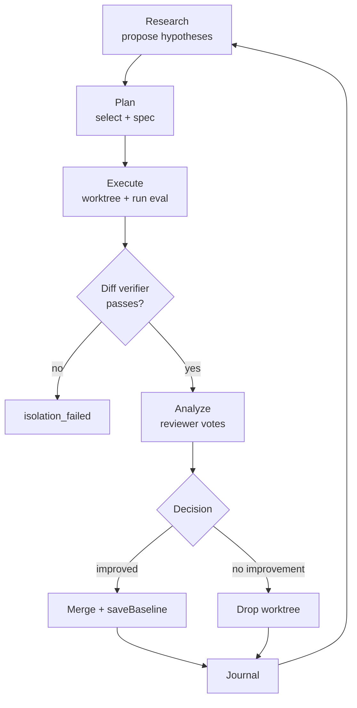

# Experiment platform

An autonomous loop that proposes improvements, tests them in isolated git worktrees, and merges what works. Every experiment is a TypeScript plugin that defines what to run, how to measure results, and what counts as an improvement. The engine runs the 6-phase cycle and knows nothing about individual evals.

## Quick start

```bash
# Dry run — no API calls, no eval harness
bun loop/loop.ts --runs 1 --dry-run

# Run 5 iterations against the active experiment
bun loop/loop.ts --runs 5

# Run until stopped
bun loop/loop.ts

# Stop after the current phase completes
touch loop/STOP
```

## How it works

Each iteration runs 6 phases in sequence:

| Phase | Script | What it does |
|-------|--------|--------------|
| Research | `phase-1-research.ts` | Reads context files and past hypothesis outcomes; proposes new hypotheses with declared independent variables |
| Plan | `phase-2-plan.ts` | Selects hypotheses, assigns them to worktrees (a/b/c), writes `ExperimentSpec` for each |
| Execute | `phase-3-execute.ts` | Creates a git worktree per approach, runs the implementer agent, calls `experiment.run()` to measure |
| Analyze | `phase-4-analyze.ts` | Runs reviewer agents; each votes keep/drop based on `isImprovement()` output |
| Decide | `phase-5-decide.ts` | Merges winning approaches, drops losers, updates the baseline via `saveBaseline()` |
| Journal | `phase-6-journal.ts` | Appends a structured entry to `loop/journal.md` and updates `hypotheses.jsonl` |

Data flow for a single approach:

```
hypothesis (proposed)
  → ExperimentSpec (planned)
  → git worktree created
  → experiment.run(worktreePath, outputDir) → Metrics
  → diff verifier checks isolation
  → experiment.isImprovement(metrics, baseline) → decision
  → merge to main OR drop worktree
  → experiment.saveBaseline(runDir) (if merged)
  → hypothesis.transition("accepted" | "rejected")
```



## Directory layout

```
loop/
  loop.ts                    # Orchestrator — sequences phases, manages sentinels
  config.json                # Active experiment ID and loop settings
  engine/
    types.ts                 # Experiment interface, Hypothesis, Metrics types
    plugin-registry.ts       # Maps experiment IDs to plugin loaders
    hypothesis.ts            # Append-only JSONL registry (hypotheses.jsonl)
    diff-verifier.ts         # Enforces single-variable isolation per worktree
  experiments/
    tech-writer-quality/     # Eval for LLM technical writing quality
    agent-routing/           # Eval for skill/task tool routing accuracy
  phases/
    phase-1-research.ts      # Research agent orchestration
    phase-2-plan.ts          # Hypothesis selection and spec writing
    phase-3-execute.ts       # Worktree creation, implementer, eval runner
    phase-4-analyze.ts       # Reviewer agents
    phase-5-decide.ts        # Merge/drop logic
    phase-6-journal.ts       # Structured journal append
  templates/
    research-prompts.md      # Research agent prompt templates
    planner.md               # Planner agent prompt
    implementer.md           # Implementer agent prompt
    reviewer.md              # Reviewer agent prompt
  lib/
    agent.ts                 # Spawns Claude Code subprocess
    worktree.ts              # Git worktree create/remove helpers
    state.ts                 # Reads/writes loop/state.json
    metrics.ts               # Shared metric utilities
    decision.ts              # Merge/drop logic helpers
```

## Writing a new experiment

This section covers everything you need to ship a new experiment plugin. After completing these four steps, your experiment is fully integrated and the loop runs it on the next invocation.

### Step 1: Create the plugin file

```
loop/experiments/<your-experiment-name>/experiment.ts
```

### Step 2: Implement the `Experiment` interface

Copy this interface from `loop/engine/types.ts`:

```typescript
export interface Experiment {
  // Identity
  readonly name: string;          // matches the directory name and config.json experiment_id
  readonly description: string;

  // Execution
  run(worktreePath: string, outputDir: string): Promise<Metrics>;
  readBaseline(): Promise<Metrics | null>;
  saveBaseline(runDir: string): Promise<void>;

  // Decision
  isImprovement(current: Metrics, baseline: Metrics): { improved: boolean; reason: string };
  isRegression(current: Metrics, baseline: Metrics): { regressed: boolean; reason: string };

  // Display
  formatMetrics(metrics: Metrics): string;
  formatDelta(current: Metrics, baseline: Metrics): string;
  formatBaseline(): Promise<string>;

  // Research guidance
  readonly changeableFiles: string[];   // glob patterns — agents may only edit these
  readonly contextFiles: string[];      // files injected into research prompts
  readonly researchHints: string[];     // domain knowledge for research agents
  readonly dependentVariables: string[]; // metric names agents reference in hypotheses

  // Optional
  readonly alwaysAllowedChanges?: string[];    // lock files, generated artifacts
  readonly decisionCriteriaText?: string;      // custom reviewer prompt text
}
```

`Metrics` is `Record<string, number | string | boolean | null>`. All keys must be JSON-serializable.

### Step 3: Register in plugin-registry.ts

Add your experiment to the `REGISTRY` object in `loop/engine/plugin-registry.ts`:

```typescript
const REGISTRY: Record<string, () => Promise<Experiment>> = {
  "tech-writer-quality": () =>
    import("../experiments/tech-writer-quality/experiment.ts").then(
      (m) => m.default as Experiment
    ),
  "agent-routing": () =>
    import("../experiments/agent-routing/experiment.ts").then(
      (m) => m.default as Experiment
    ),
  // Add your experiment here:
  "prompt-cost-optimizer": () =>
    import("../experiments/prompt-cost-optimizer/experiment.ts").then(
      (m) => m.default as Experiment
    ),
};
```

### Step 4: Set experiment_id in config.json

```json
{
  "experiment_id": "prompt-cost-optimizer"
}
```

Or override at runtime without changing the file:

```bash
bun loop/loop.ts --experiment prompt-cost-optimizer --runs 3
```

---

### Method reference with examples

The `tech-writer-quality` plugin is the reference implementation. Each method below shows the pattern.

#### `run(worktreePath, outputDir)` — invoke your eval harness

The engine calls `run()` with an isolated git worktree and a directory to write artifacts. Call your eval script inside `worktreePath`, then parse the output into a `Metrics` record.

```typescript
async run(worktreePath: string, outputDir: string): Promise<Metrics> {
  const runSh = join(worktreePath, "tech-writer-eval", "run.sh");

  const result = await spawnShell(
    ["bash", runSh, "--compare-baseline", "--output-dir", outputDir],
    { cwd: worktreePath, allowFailure: true }
  );

  if (result.code === 1) {
    // Exit code 1 = regression from compare-baseline.sh
    const partialMetrics = tryParseReport(outputDir);
    throw new RegressionError(partialMetrics, "regression detected");
  }

  return parseReport(outputDir);
  // Returns: { tech_writer_weighted: 8.2, tech_writer_borda: 19, tech_writer_friedman_p: 0.38, ... }
}
```

The eval harness can be anything — a shell script, `npx`, a Python subprocess. The plugin owns the invocation.

#### `readBaseline()` / `saveBaseline(runDir)` — persist your baseline

```typescript
async readBaseline(): Promise<Metrics | null> {
  const scoresPath = join(BASELINE_DIR, "scores.json");
  if (!existsSync(scoresPath)) return null;
  const raw = JSON.parse(readFileSync(scoresPath, "utf-8"));
  return extractMetrics(raw);
  // Returns null on first run — engine skips delta display
}

async saveBaseline(runDir: string): Promise<void> {
  // runDir is the outputDir from run() — artifact files are already there
  await spawnShell(["bash", captureScript, runDir], { cwd: EVAL_DIR });
  // The engine calls this only after a successful merge
}
```

Store baselines wherever makes sense for your eval. The engine does not care about the storage mechanism.

#### `isImprovement()` / `isRegression()` — define success criteria

`isImprovement()` controls whether the engine merges an approach. `isRegression()` is a veto: returning `regressed: true` drops the approach regardless of reviewer votes.

```typescript
isImprovement(
  current: Metrics,
  baseline: Metrics
): { improved: boolean; reason: string } {
  const bordaDelta = numDelta(current, baseline, "tech_writer_borda");
  const weightedDelta = numDelta(current, baseline, "tech_writer_weighted");

  if (bordaDelta !== null && bordaDelta >= 1) {
    return { improved: true, reason: `borda +${bordaDelta}` };
  }
  if (weightedDelta !== null && weightedDelta >= 0.1) {
    return { improved: true, reason: `weighted +${weightedDelta.toFixed(2)}` };
  }

  return { improved: false, reason: `borda ${bordaDelta ?? "n/a"}, weighted ${weightedDelta?.toFixed(2) ?? "n/a"} — below thresholds` };
},

isRegression(
  current: Metrics,
  baseline: Metrics
): { regressed: boolean; reason: string } {
  const weightedDelta = numDelta(current, baseline, "tech_writer_weighted");
  if (weightedDelta !== null && weightedDelta < -0.5) {
    return { regressed: true, reason: `score dropped ${Math.abs(weightedDelta).toFixed(2)} points` };
  }
  return { regressed: false, reason: "" };
},
```

#### `formatMetrics()` / `formatDelta()` — one-line display strings

These appear in iteration banners, the journal, and reviewer context. Keep them compact.

```typescript
formatMetrics(metrics: Metrics): string {
  // Output: "TW techwriter=8.2 borda=19 p=0.38 (5 judges)"
  const parts = ["TW"];
  if (metrics.tech_writer_weighted != null) parts.push(`techwriter=${Number(metrics.tech_writer_weighted).toFixed(1)}`);
  if (metrics.tech_writer_borda != null) parts.push(`borda=${metrics.tech_writer_borda}`);
  return parts.join(" ");
},

formatDelta(current: Metrics, baseline: Metrics): string {
  // Output: "Δ weighted +0.2, borda +1, p -0.08"
  const w = numDelta(current, baseline, "tech_writer_weighted");
  const b = numDelta(current, baseline, "tech_writer_borda");
  return `Δ weighted ${w != null ? (w >= 0 ? "+" : "") + w.toFixed(1) : "n/a"}, borda ${b != null ? (b >= 0 ? "+" : "") + b : "n/a"}`;
},
```

#### Research guidance fields

These three fields shape what AI agents do during the Research and Plan phases.

**`changeableFiles`** — the only files agents may modify. The diff verifier enforces this.

```typescript
changeableFiles: [
  "tech-writer-eval/prompts/*.md",
  "tech-writer-eval/test-cases.json",
],
```

**`contextFiles`** — files injected into research agent prompts so agents understand the current state.

```typescript
contextFiles: [
  "tech-writer-eval/prompts/generate-techwriter.md",
  "tech-writer-eval/prompts/judge-template-4way.md",
  "tech-writer-eval/test-cases.json",
],
```

**`researchHints`** — domain knowledge that research agents read before proposing hypotheses. Be specific about what matters.

```typescript
researchHints: [
  "The Friedman test measures inter-judge consistency. More topics → more statistical power.",
  "Borda counts sum judge ranking positions. Higher is better.",
  "Never modify baselines/ — the engine updates the baseline after merging.",
],
```

**`dependentVariables`** — metric keys that agents reference when writing hypotheses. These must match keys that `run()` actually returns.

```typescript
dependentVariables: ["tech_writer_weighted", "tech_writer_borda", "tech_writer_friedman_p"],
```

---

### Minimal example: prompt-cost-optimizer

```typescript
// loop/experiments/prompt-cost-optimizer/experiment.ts
import { join } from "node:path";
import { existsSync, readFileSync, writeFileSync, mkdirSync } from "node:fs";
import type { Experiment, Metrics } from "../../engine/types.ts";

const REPO_ROOT = join(import.meta.dir, "../..");
const BASELINE_PATH = join(REPO_ROOT, "prompt-cost-eval", "baseline.json");

export default {
  name: "prompt-cost-optimizer",
  description: "Reduce token usage while maintaining response quality",

  async run(worktreePath: string, outputDir: string): Promise<Metrics> {
    mkdirSync(outputDir, { recursive: true });
    const proc = Bun.spawn(
      ["bun", "prompt-cost-eval/run.ts", "--output", join(outputDir, "results.json")],
      { cwd: worktreePath, stdout: "pipe", stderr: "pipe" }
    );
    if (await proc.exited !== 0) throw new Error("eval failed");

    const results = JSON.parse(readFileSync(join(outputDir, "results.json"), "utf-8")) as {
      avg_tokens: number;
      quality_score: number;
      test_count: number;
    };
    return {
      avg_tokens: results.avg_tokens,
      quality_score: results.quality_score,
      test_count: results.test_count,
    };
  },

  async readBaseline(): Promise<Metrics | null> {
    if (!existsSync(BASELINE_PATH)) return null;
    return JSON.parse(readFileSync(BASELINE_PATH, "utf-8")) as Metrics;
  },

  async saveBaseline(runDir: string): Promise<void> {
    const src = join(runDir, "results.json");
    const results = JSON.parse(readFileSync(src, "utf-8")) as Metrics;
    mkdirSync(join(REPO_ROOT, "prompt-cost-eval"), { recursive: true });
    writeFileSync(BASELINE_PATH, JSON.stringify(results, null, 2));
  },

  isImprovement(current: Metrics, baseline: Metrics) {
    const tokenDelta = Number(baseline.avg_tokens) - Number(current.avg_tokens);
    const qualityDelta = Number(current.quality_score) - Number(baseline.quality_score);

    // Require: fewer tokens AND quality doesn't drop
    if (tokenDelta >= 50 && qualityDelta >= -0.1) {
      return { improved: true, reason: `tokens -${tokenDelta} (quality ${qualityDelta >= 0 ? "+" : ""}${qualityDelta.toFixed(2)})` };
    }
    return { improved: false, reason: `token reduction ${tokenDelta} below 50 threshold` };
  },

  isRegression(current: Metrics, baseline: Metrics) {
    const qualityDelta = Number(current.quality_score) - Number(baseline.quality_score);
    if (qualityDelta < -0.5) {
      return { regressed: true, reason: `quality dropped ${Math.abs(qualityDelta).toFixed(2)} points` };
    }
    return { regressed: false, reason: "" };
  },

  formatMetrics(metrics: Metrics): string {
    return `tokens=${metrics.avg_tokens} quality=${Number(metrics.quality_score).toFixed(2)}`;
    // Output: "tokens=1240 quality=7.85"
  },

  formatDelta(current: Metrics, baseline: Metrics): string {
    const td = Number(baseline.avg_tokens) - Number(current.avg_tokens);
    const qd = Number(current.quality_score) - Number(baseline.quality_score);
    return `Δ tokens -${td} quality ${qd >= 0 ? "+" : ""}${qd.toFixed(2)}`;
    // Output: "Δ tokens -240 quality +0.05"
  },

  async formatBaseline(): Promise<string> {
    const b = await this.readBaseline();
    if (!b) return "## prompt-cost-optimizer baseline\n- No baseline yet";
    return `## prompt-cost-optimizer baseline\n- ${this.formatMetrics(b)}`;
  },

  changeableFiles: ["prompt-cost-eval/prompts/*.md"],
  contextFiles: ["prompt-cost-eval/prompts/system.md", "prompt-cost-eval/test-cases.yaml"],
  researchHints: [
    "Token count is measured via API response metadata, not estimated.",
    "Quality is judged on a 1-10 scale by a separate evaluator prompt.",
    "Reducing system prompt length is the primary lever for token reduction.",
  ],
  dependentVariables: ["avg_tokens", "quality_score"],
} satisfies Experiment;
```

## Hypothesis tracking

Research agents propose hypotheses with a declared independent variable (the one thing being changed), dependent variables (the metrics being measured), and a list of files they intend to modify.

```
h-0007: "Add 3 new evaluation topics to test-cases.json"
  independentVar: { description: "test case count", from: 5, to: 8 }
  dependentVars: ["tech_writer_friedman_p", "tech_writer_borda"]
  filesToChange: ["tech-writer-eval/test-cases.json"]
  direction: "increase"
  effectSizeExpected: 2.0
```

The diff verifier runs `git diff --name-only HEAD` in the worktree after the implementer finishes. Any changed file not covered by `filesToChange` (or the plugin's `changeableFiles`) fails isolation and marks the hypothesis `isolation_failed`. The worktree is dropped.

Outcomes feed forward. Before the Research phase, the engine calls `registry.getKnowledgeSummary()` and injects the last 10 resolved hypotheses into the research agent prompt:

```
| h-0003 | Add second eval topic   | tech_writer_borda | increase | borda=19 | accepted   | 4 |
| h-0005 | Shorten judge preamble  | tech_writer_borda | decrease | borda=17 | rejected   | 5 |
| h-0007 | Use 4-judge panel       | tech_writer_friedman_p | decrease | p=0.38 | accepted | 6 |
```

Two files record the state:

- `loop/hypotheses.jsonl` — append-only log of `created` and `transition` events; replayed to derive current state
- `loop/experiment-ledger.jsonl` — compact per-hypothesis outcome records for analytics

## CLI reference

```
bun loop/loop.ts [options]

  --runs N                  Run exactly N iterations from the current position
  --max-iterations N        Stop after reaching iteration N (absolute cap)
  --dry-run                 Stub all agent calls and eval invocations
  --iteration N             Start at iteration N instead of reading state.json
  --resume-from-phase NAME  Skip phases before NAME in the first iteration
                            Phase names: research, plan, execute, analyze, decide, journal
  --experiment ID           Override the experiment_id from config.json
```

**Examples:**

```bash
# Resume a failed iteration 7 starting from the execute phase
bun loop/loop.ts --iteration 7 --resume-from-phase execute

# Run the agent-routing experiment for 2 iterations without touching config.json
bun loop/loop.ts --experiment agent-routing --runs 2

# Dry-run iteration 1 to verify phase scripts load correctly
bun loop/loop.ts --runs 1 --dry-run --iteration 1
```

## Configuration

`loop/config.json` controls the active experiment and loop behavior:

```jsonc
{
  "version": "1.0",

  // Which experiment plugin to load. Must match a key in plugin-registry.ts.
  "experiment_id": "tech-writer-quality",

  // Iteration cap. null = unlimited (stop with STOP file or --runs).
  "max_iterations": null,

  // Cost per agent type in USD (informational — logged but not enforced).
  "cost_table": {
    "tech_writer_api_call_usd": 0.002,
    "research_agent_usd": 0.005,
    "reviewer_agent_usd": 0.003
  },

  // Shown in iteration banner as a cost heads-up.
  "estimated_cost_per_iteration_usd": 0.25,

  // After this many consecutive all-dropped iterations, write loop/STALLED.
  "stall_threshold_consecutive_iterations": 3,

  // Where git worktrees are created (should be outside the repo).
  "worktree_base_dir": "/tmp/magus-bench-loop",

  // Regression veto threshold applied by isRegression() if the plugin doesn't
  // override it. Not directly used by the engine — plugins read this via researchHints.
  "baseline_regression_threshold": 0.5,

  // Optional success condition (informational in v1 — not auto-stopping).
  "success_condition": {
    "friedman_p_lt": 0.05,
    "sustained_iterations": 3
  }
}
```

## Control files

Three sentinel files control the loop from outside:

| File | How to create | What happens |
|------|---------------|--------------|
| `loop/STOP` | `touch loop/STOP` | Loop exits cleanly after the current phase completes. Remove the file to restart. |
| `loop/LOCK` | Created automatically | Prevents a second instance from starting. Delete manually if a prior run crashed without cleanup. |
| `loop/STALLED` | Written by the loop | Created when `stall_threshold_consecutive_iterations` all-dropped iterations accumulate. Contains a human-readable message. Delete to let the loop continue. |

## Troubleshooting

### "Unknown experiment_id" on startup

**Symptom:**
```
Error: Unknown experiment_id "my-experiment". Registered: tech-writer-quality, agent-routing
```

**Cause:** The experiment is not in `REGISTRY` in `plugin-registry.ts`.

**Fix:** Add the loader entry to `REGISTRY` (see [Step 3](#step-3-register-in-plugin-registryts) above).

---

### Plugin fails validation: "missing required fields"

**Symptom:**
```
Error: Plugin "my-experiment" is missing required fields: formatBaseline, dependentVariables
```

**Fix:** Implement every method and property in the `Experiment` interface. Use `satisfies Experiment` on your export object to catch missing fields at compile time:

```typescript
export default { /* ... */ } satisfies Experiment;
```

---

### Isolation failure drops every approach

**Symptom:** Every approach ends with `status: "isolation_failed"` in the experiment result.

**Cause:** The implementer agent is modifying files outside `changeableFiles` — for example, writing to `node_modules/`, updating a lock file, or creating log files.

**Fix:** Add the patterns to `alwaysAllowedChanges` in your plugin:

```typescript
alwaysAllowedChanges: ["bun.lockb", "some-tool/output/**"],
```

---

### Loop exits with STALLED immediately

**Symptom:** `loop/STALLED` appears after 3 iterations.

**Cause:** `isImprovement()` returns `improved: false` for every approach in every iteration. Either the thresholds are too strict or the eval harness is not detecting real differences.

**Fix:** Check your improvement thresholds in `isImprovement()`. Run your eval harness manually against two different configurations and confirm the metrics differ by more than the threshold.

---

### LOCK file left after crash

**Symptom:**
```
ERROR: loop/LOCK exists — another loop process may be running.
```

**Fix:** Verify no loop process is running (`pgrep -f loop.ts`), then delete the file:

```bash
rm loop/LOCK
```
